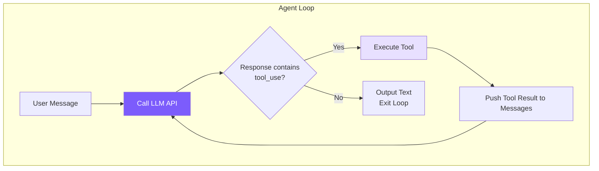

# 1. Agent Loop -- The Core Cycle

## Chapter Goals

Implement the heart of a coding agent: a while loop that continuously calls the LLM -> checks whether tools need to be executed -> executes tools -> feeds results back to the LLM -> repeats, until the LLM considers the task complete.



## How Claude Code Does It

### Two-Layer Architecture

Claude Code splits the Agent Loop into two layers:

- **QueryEngine** (~1155 lines): Session-level, manages the entire conversation lifecycle -- user input processing, USD budget checks, token accounting, session recovery
- **queryLoop** (~1728 lines): Single-turn level, manages one query's execution -- message compaction, API calls, tool execution, error recovery

The benefit of this split is separation of concerns: QueryEngine doesn't need to know "how to recover from a PTL error," and queryLoop doesn't need to know "how to parse user input."

### queryLoop: Async Generator

queryLoop's signature is `async function*` -- an async generator. The reasons for choosing this over callbacks/events:

1. **Backpressure control**: The producer won't continue until the consumer finishes processing, naturally preventing event buildup
2. **Linear control flow**: All loop branches are expressed with plain `continue` / `break`, no state machine needed

### Seven Continue Reasons

The loop has 7 continuation points, corresponding to 7 different scenarios:

| # | Name | Trigger Scenario | Handling Strategy |
|---|------|-----------------|-------------------|
| 1 | `next_turn` | Model called a tool | Execute tool, push result to messages, continue |
| 2 | `collapse_drain_retry` | PTL error, pending collapse operations | Commit collapse to free space, retry |
| 3 | `reactive_compact_retry` | PTL error, collapse space insufficient | Force full summary compaction, retry |
| 4 | `max_output_tokens_escalate` | Output token truncation, first time | Escalate to higher token limit (16K->64K), retry |
| 5 | `max_output_tokens_recovery` | Output token truncation, escalation unavailable | Inject continuation prompt, retry up to 3 times |
| 6 | `stop_hook_blocking` | Task complete but Stop Hook blocked | Continue execution loop |
| 7 | `token_budget_continuation` | API-side token budget exhausted | Continue generation |

Our simplified implementation only handles case 1: continue if there's a tool_use, otherwise stop.

### Error Withholding Strategy

This design deserves special attention: **recoverable errors are not immediately exposed to the upper layer**.

When output tokens are truncated, directly yielding the error to QueryEngine would show an error in the UI -- but queryLoop's subsequent recovery logic can actually handle this automatically. So Claude Code's approach is to "withhold" the error first, execute recovery logic, and if successful, the user never notices. Only if recovery fails is the error finally exposed. Most `max_output_tokens` and `prompt_too_long` errors are silently handled this way.

### Parallel Tool Execution

Claude Code uses `StreamingToolExecutor` to execute tools in parallel during the API streaming response:

```
Serial (our implementation):
  [========= API streaming response =========][tool1][tool2][tool3]

Parallel (Claude Code):
  [========= API streaming response =========]
       ^ tool1's JSON complete -> execute immediately
            ^ tool2's JSON complete -> execute immediately
```

A typical API response has a 5-30 second streaming window, during which multiple tools can complete concurrently.

## Our Implementation

We merge the two-layer architecture into a single `Agent` class, with `chatAnthropic()` as the core method:

<!-- tabs:start -->
#### **TypeScript**
```typescript
// agent.ts -- chatAnthropic method (core Agent Loop)

private async chatAnthropic(userMessage: string): Promise<void> {
  this.anthropicMessages.push({ role: "user", content: userMessage });

  while (true) {
    if (this.abortController?.signal.aborted) break;

    const response = await this.callAnthropicStream();

    // Accumulate token usage
    this.totalInputTokens += response.usage.input_tokens;
    this.totalOutputTokens += response.usage.output_tokens;
    this.lastInputTokenCount = response.usage.input_tokens;

    // Extract tool_use blocks
    const toolUses: Anthropic.ToolUseBlock[] = [];
    for (const block of response.content) {
      if (block.type === "tool_use") toolUses.push(block);
    }

    // Push assistant response into history
    this.anthropicMessages.push({ role: "assistant", content: response.content });

    // No tool calls -> task complete
    if (toolUses.length === 0) {
      printCost(this.totalInputTokens, this.totalOutputTokens);
      break;
    }

    // Execute each tool serially
    const toolResults: Anthropic.ToolResultBlockParam[] = [];
    for (const toolUse of toolUses) {
      if (this.abortController?.signal.aborted) break;

      const input = toolUse.input as Record<string, any>;
      printToolCall(toolUse.name, input);

      // Permission check (see Chapter 6)
      const perm = checkPermission(toolUse.name, input, this.permissionMode, this.planFilePath);
      if (perm.action === "deny") {
        toolResults.push({ type: "tool_result", tool_use_id: toolUse.id,
          content: `Action denied: ${perm.message}` });
        continue;
      }
      if (perm.action === "confirm" && perm.message && !this.confirmedPaths.has(perm.message)) {
        const confirmed = await this.confirmDangerous(perm.message);
        if (!confirmed) {
          toolResults.push({ type: "tool_result", tool_use_id: toolUse.id,
            content: "User denied this action." });
          continue;
        }
        this.confirmedPaths.add(perm.message);
      }

      const result = await executeTool(toolUse.name, input);
      printToolResult(toolUse.name, result);
      toolResults.push({ type: "tool_result", tool_use_id: toolUse.id, content: result });
    }

    // Push tool results as user message (Anthropic API requirement)
    this.anthropicMessages.push({ role: "user", content: toolResults });

    // Context compaction check (see Chapter 7)
    await this.checkAndCompact();
  }
}
```
#### **Python**
```python
# agent.py -- _chat_anthropic method (core Agent Loop)

async def _chat_anthropic(self, user_message: str) -> None:
    self._anthropic_messages.append({"role": "user", "content": user_message})

    while True:
        if self._aborted:
            break

        self._run_compression_pipeline()
        response = await self._call_anthropic_stream()

        self.total_input_tokens += response.usage.input_tokens
        self.total_output_tokens += response.usage.output_tokens
        self.last_input_token_count = response.usage.input_tokens

        tool_uses = [b for b in response.content if b.type == "tool_use"]

        self._anthropic_messages.append({
            "role": "assistant",
            "content": [self._block_to_dict(b) for b in response.content],
        })

        if not tool_uses:
            if not self.is_sub_agent:
                print_cost(self.total_input_tokens, self.total_output_tokens)
            break

        tool_results = []
        for tu in tool_uses:
            if self._aborted:
                break
            inp = dict(tu.input) if hasattr(tu.input, 'items') else tu.input
            print_tool_call(tu.name, inp)

            # Permission check (see Chapter 6)
            perm = check_permission(tu.name, inp, self.permission_mode, self._plan_file_path)
            if perm["action"] == "deny":
                tool_results.append({"type": "tool_result", "tool_use_id": tu.id,
                                     "content": f"Action denied: {perm.get('message', '')}"})
                continue
            if perm["action"] == "confirm" and perm.get("message") \
               and perm["message"] not in self._confirmed_paths:
                confirmed = await self._confirm_dangerous(perm["message"])
                if not confirmed:
                    tool_results.append({"type": "tool_result", "tool_use_id": tu.id,
                                         "content": "User denied this action."})
                    continue
                self._confirmed_paths.add(perm["message"])

            result = await self._execute_tool_call(tu.name, inp)
            print_tool_result(tu.name, result)
            tool_results.append({"type": "tool_result", "tool_use_id": tu.id, "content": result})

        self._anthropic_messages.append({"role": "user", "content": tool_results})
        await self._check_and_compact()
```
<!-- tabs:end -->

### How the Message Array Grows

The key to understanding the Agent Loop is how the message array grows.

```
Turn 1:
  messages = [
    { role: "user",      content: "Help me fix the bug" }
    { role: "assistant", content: [text + tool_use(read_file)] }
    { role: "user",      content: [tool_result("file contents...")] }
  ]

Turn 2 (LLM sees file contents and decides to edit):
  messages = [
    ...first 3 messages,
    { role: "assistant", content: [text + tool_use(edit_file)] }
    { role: "user",      content: [tool_result("edit successful")] }
  ]

Turn 3 (LLM considers task complete):
  messages = [
    ...first 5 messages,
    { role: "assistant", content: [text("Fixed!")] }  <- no tool_use -> break
  ]
```

Each loop iteration adds two messages to the array: one assistant, one user (tool result). The model sees the complete history every time, which is how it "remembers" what it has done before. Tool results are pushed with `role: "user"` as required by the Anthropic API protocol, and results must be linked back to the corresponding call via `tool_use_id`.

### AbortController: Graceful Interruption

<!-- tabs:start -->
#### **TypeScript**
```typescript
async chat(userMessage: string): Promise<void> {
  this.abortController = new AbortController();
  try {
    await this.chatAnthropic(userMessage);
  } finally {
    this.abortController = null;
  }
  printDivider();
  this.autoSave();
}

abort() {
  this.abortController?.abort();
}
```
#### **Python**
```python
async def chat(self, user_message: str) -> None:
    self._aborted = False
    try:
        if self.use_openai:
            await self._chat_openai(user_message)
        else:
            await self._chat_anthropic(user_message)
    finally:
        pass
    if not self.is_sub_agent:
        print_divider()
        self._auto_save()

def abort(self) -> None:
    self._aborted = True
```
<!-- tabs:end -->

`AbortController` is the standard interruption mechanism: once `abort()` is called, the signal becomes `aborted`, and the loop exits at the next checkpoint. The signal is also passed to the API call, ensuring network requests can be cancelled too.

---

> **Next chapter**: The driving force of the loop is tools -- without tools, the LLM is just a chatbot. Let's look at the tool system implementation.
