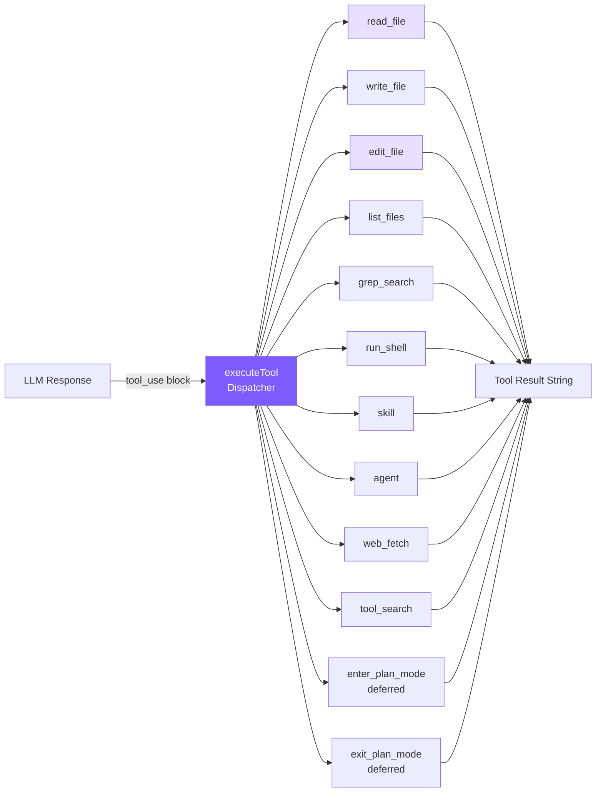
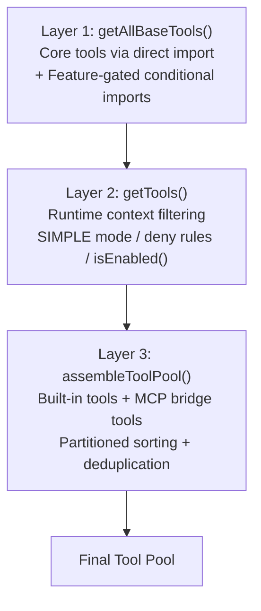
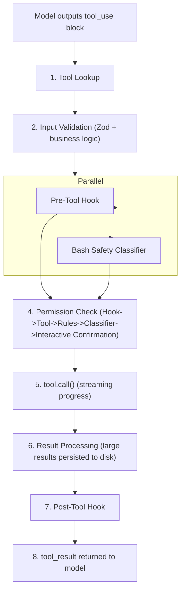

# 2. Tool System

## Chapter Goals

Define 6 core tools (read file, write file, edit file, list files, search, Shell) + 5 extension tools (skill, agent, web_fetch, tool_search, plan mode), enabling the LLM to actually operate on your codebase. Implement edit safeguards (read-before-edit + mtime checking) and deferred tools (lazy loading) mechanism.



## How Claude Code Does It

### Tool Interface -- The Complete Contract for Each Tool

Every tool in Claude Code follows a unified `Tool` generic interface -- not a simple function signature, but a complete behavioral contract:

```typescript
type Tool<Input, Output, P extends ToolProgressData> = {
  name: string
  aliases?: string[]              // Deprecated aliases for smooth migration
  maxResultSizeChars: number      // Persists to disk if exceeded

  call(args, context, canUseTool, parentMessage, onProgress?): Promise<ToolResult<Output>>

  description(input, options): Promise<string>  // Tool description sent to API
  prompt(options): Promise<string>              // Usage guide injected into system prompt

  inputSchema: Input              // Zod Schema (runtime validation + type inference)
  inputJSONSchema?: ToolInputJSONSchema

  isConcurrencySafe(input): boolean   // Takes input: same tool with different args can have different safety semantics
  isReadOnly(input): boolean
  isDestructive?(input): boolean
  checkPermissions(input, context): Promise<PermissionResult>

  renderToolUseMessage(input, options): React.ReactNode  // Each tool has its own rendering
  renderToolResultMessage?(content, progress, options): React.ReactNode
}
```

Several design highlights:

**`isConcurrencySafe(input)` takes parameters** -- this means the same tool can have different safety semantics for different inputs. BashTool returns `isReadOnly: true` for `ls` and `false` for `rm`. Far more precise than labeling an entire tool.

**`prompt()` method** -- each tool can inject its own usage guide into the system prompt. FileEditTool injects "exact match" rules, BashTool injects safe execution reminders. Tool behavior guidelines are tightly coupled with tool definitions, rather than scattered across a global prompt file.

**Rendering methods** -- each tool carries its own rendering logic; adding new tools doesn't require modifying global rendering code.

### buildTool Factory -- Fail-Closed Defaults

```typescript
const TOOL_DEFAULTS = {
  isConcurrencySafe: () => false,    // Not concurrency-safe by default
  isReadOnly: () => false,           // Has write side effects by default
  isDestructive: () => false,
  checkPermissions: () => ({ behavior: 'allow', updatedInput }),
}
```

This is a **fail-closed** design: incorrectly marking a "read-only" tool as "non-read-only" results in unnecessary permission prompts (annoying but safe); the reverse error -- incorrectly marking a "write" tool as "read-only" -- could let it execute concurrently without permission checks (dangerous and subtle). Defaults can only go in the safe direction.

### Tool Registration -- Three-Layer Pipeline



Layer 1's feature-gated tools load via conditional `require()`:

```typescript
const SleepTool = feature('PROACTIVE') || feature('KAIROS')
  ? require('./tools/SleepTool/SleepTool.js').SleepTool
  : null
```

`feature()` is a compile-time macro for the Bun bundler. It evaluates to `false` in external builds, and the entire `require()` is eliminated as dead code -- internal tools physically don't exist in the external binary.

Layer 3's partitioned sorting: built-in tools come first in alphabetical order, MCP tools are appended after, with no global sorting. The reason is that the API server sets a cache breakpoint after the last built-in tool, so partitioning ensures that adding MCP tools doesn't affect cache hits for built-in tools.

### Tool Execution Lifecycle -- 8 Stages



Several stages worth noting:

**Stage 2 Two-Phase Validation**: Phase 1 is Zod Schema (field types), Phase 2 is business logic (e.g., FileEditTool checks whether old_string is unique). Separating them ensures low-cost checks run first, reducing unnecessary disk I/O.

**Stage 3 Parallel Launch**: Pre-Tool Hook and Bash classifier start simultaneously, each taking tens to hundreds of milliseconds. Parallelization reduces total permission check latency.

**Stage 6 Large Result Handling**: When results exceed `maxResultSizeChars`, the full content is saved to `~/claude-code/tool-results/`, and the model receives a file path + truncation indicator. It can actively retrieve content via FileReadTool when needed.

> **Core design philosophy: errors are data, not exceptions.** Errors at any stage are converted into `tool_result` with `is_error: true` and returned to the model, letting the model self-correct.

### Concurrency Control

```typescript
private canExecuteTool(isConcurrencySafe: boolean): boolean {
  const executingTools = this.tools.filter(t => t.status === 'executing')
  return (
    executingTools.length === 0 ||
    (isConcurrencySafe && executingTools.every(t => t.isConcurrencySafe))
  )
}
```

The rule is simple: non-concurrency-safe tools must execute exclusively; multiple concurrency-safe tools can run simultaneously. `StreamingToolExecutor` doesn't wait for the model to finish outputting all tool_use blocks -- as soon as it detects a complete block, it starts execution immediately. Tool execution latency is about 1 second, while model streaming output lasts 5-30 seconds, so most tools can be completely hidden within the streaming window.

Concurrency cap: `MAX_TOOL_USE_CONCURRENCY = 10`.

### edit_file's Core Design

FileEditTool has 14 validation steps before execution (ordered by I/O cost: check in-memory state first, then access disk), with three being most critical:

**Read prerequisite check**: A code-level hard constraint, not just a prompt suggestion. Execution is refused if the file hasn't been read first, ensuring the model edits based on the file's current state rather than stale memory.

**External modification detection**: Uses mtime to detect whether the file was modified externally after being read (e.g., the user edited the same file in their IDE), solving a real race condition.

**Config file protection**: For files like `.claude/settings.json`, validation simulates the edit and runs JSON Schema validation afterward, preventing seemingly reasonable edits from corrupting configuration format.

### Why Search-and-Replace

Before settling on search-and-replace, several alternatives were considered:

| Approach | Fatal Flaw |
|----------|-----------|
| Line-number editing | Position-dependent: after inserting 3 lines the first time, all subsequent line numbers shift, requiring complex recalculation for multi-step edits |
| AST editing | Files with syntax errors are exactly the ones that need editing most, but AST parsers error out on syntax errors |
| Unified diff | LLMs perform poorly generating strict formats: any error in hunk header line numbers, `+`/`-`/space prefixes makes the patch inapplicable |
| Full file rewrite | Wastes tokens on large files; model may omit unchanged code; users can't quickly review |
| **String replacement** | None of the above flaws |

The most underrated advantage of search-and-replace is **hallucination safety**: if the model provides a string that doesn't exist in the file, the tool simply fails, and the model re-reads the file to correct its memory. Full file rewrite could silently write incorrect content to the file.

## Our Simplification Decisions

| Claude Code's Design | Our Simplification | Reason |
|---------------------|-------------------|--------|
| 66+ tool classes, each in its own directory | 1 file + 6 functions | Tutorial doesn't need industrial-grade modularity |
| 8-stage lifecycle | Direct switch dispatch + execution | Skip Hook, permission checks, classifier |
| StreamingToolExecutor concurrency | Serial execution one by one | Avoid concurrency complexity |
| 14-step validation pipeline | Uniqueness check + quote tolerance | Keep only the 2 most critical validations |
| Three-tier large result limits | Single 50K truncation layer | Enough to prevent context explosion |
| MCP 7 transports + OAuth | No MCP support | Tutorial focuses on core concepts |

Core principle: **Preserve the design philosophy, cut the engineering complexity**.

## Our Implementation

### Tool Definitions: Static Array

<!-- tabs:start -->
#### **TypeScript**
```typescript
// tools.ts -- Tool definitions (Anthropic Tool schema format)

export const toolDefinitions: ToolDef[] = [
  {
    name: "read_file",
    description: "Read the contents of a file. Returns the file content with line numbers.",
    input_schema: {
      type: "object",
      properties: {
        file_path: { type: "string", description: "The path to the file to read" },
      },
      required: ["file_path"],
    },
  },
  {
    name: "write_file",
    description: "Write content to a file. Creates the file if it doesn't exist, overwrites if it does.",
    input_schema: {
      type: "object",
      properties: {
        file_path: { type: "string", description: "The path to the file to write" },
        content: { type: "string", description: "The content to write to the file" },
      },
      required: ["file_path", "content"],
    },
  },
  {
    name: "edit_file",
    description: "Edit a file by replacing an exact string match with new content. The old_string must match exactly.",
    input_schema: {
      type: "object",
      properties: {
        file_path: { type: "string", description: "The path to the file to edit" },
        old_string: { type: "string", description: "The exact string to find and replace" },
        new_string: { type: "string", description: "The string to replace it with" },
      },
      required: ["file_path", "old_string", "new_string"],
    },
  },
  // ... list_files, grep_search, run_shell
];
```
#### **Python**
```python
# tools.py -- Tool definitions (Anthropic Tool schema format)

tool_definitions: list[ToolDef] = [
    {
        "name": "read_file",
        "description": "Read the contents of a file. Returns the file content with line numbers.",
        "input_schema": {
            "type": "object",
            "properties": {
                "file_path": {"type": "string", "description": "The path to the file to read"},
            },
            "required": ["file_path"],
        },
    },
    # ... write_file, edit_file, list_files, grep_search, run_shell
]
```
<!-- tabs:end -->

These definitions are passed directly to the Anthropic API's `tools` parameter -- the format is exactly the same, no conversion needed.

**Why a static array instead of classes?** Claude Code uses a class hierarchy because 66+ tools need inheritance, polymorphism, and independent testing. For 6 tools, an array + a switch statement is sufficient -- simplicity itself is a value.

### Tool Execution: Switch Dispatcher

<!-- tabs:start -->
#### **TypeScript**
```typescript
export async function executeTool(
  name: string,
  input: Record<string, any>
): Promise<string> {
  let result: string;
  switch (name) {
    case "read_file":   result = readFile(input as { file_path: string }); break;
    case "write_file":  result = writeFile(input as { file_path: string; content: string }); break;
    case "edit_file":   result = editFile(input as { file_path: string; old_string: string; new_string: string }); break;
    case "list_files":  result = await listFiles(input as { pattern: string; path?: string }); break;
    case "grep_search": result = grepSearch(input as { pattern: string; path?: string; include?: string }); break;
    case "run_shell":   result = runShell(input as { command: string; timeout?: number }); break;
    default: return `Unknown tool: ${name}`;
  }
  return truncateResult(result);  // <- 50K character protection
}
```
#### **Python**
```python
async def execute_tool(name: str, inp: dict) -> str:
    handlers = {
        "read_file": _read_file,
        "write_file": _write_file,
        "edit_file": _edit_file,
        "list_files": _list_files,
        "grep_search": _grep_search,
        "run_shell": _run_shell,
    }
    handler = handlers.get(name)
    if not handler:
        return f"Unknown tool: {name}"
    return _truncate_result(handler(inp))
```
<!-- tabs:end -->

The `default` branch returns `Unknown tool: ${name}` instead of throwing an exception -- embodying the "errors are data" design, allowing the model to self-correct hallucinated tool names.

### Tool-by-Tool Walkthrough

#### read_file

<!-- tabs:start -->
#### **TypeScript**
```typescript
function readFile(input: { file_path: string }): string {
  try {
    const content = readFileSync(input.file_path, "utf-8");
    const lines = content.split("\n");
    const numbered = lines
      .map((line, i) => `${String(i + 1).padStart(4)} | ${line}`)
      .join("\n");
    return numbered;
  } catch (e: any) {
    return `Error reading file: ${e.message}`;
  }
}
```
#### **Python**
```python
def _read_file(inp: dict) -> str:
    try:
        content = Path(inp["file_path"]).read_text()
        lines = content.split("\n")
        numbered = "\n".join(f"{i+1:4d} | {line}" for i, line in enumerate(lines))
        return numbered
    except Exception as e:
        return f"Error reading file: {e}"
```
<!-- tabs:end -->

Line numbers are added so the LLM can locate code positions, but `edit_file` matches against the actual content string, not line numbers.

#### edit_file -- The Most Critical Tool

<!-- tabs:start -->
#### **TypeScript**
```typescript
function editFile(input: {
  file_path: string;
  old_string: string;
  new_string: string;
}): string {
  try {
    const content = readFileSync(input.file_path, "utf-8");

    // Unique match check
    const count = content.split(input.old_string).length - 1;
    if (count === 0)
      return `Error: old_string not found in ${input.file_path}`;
    if (count > 1)
      return `Error: old_string found ${count} times. Must be unique.`;

    const newContent = content.replace(input.old_string, input.new_string);
    writeFileSync(input.file_path, newContent);
    return `Successfully edited ${input.file_path}`;
  } catch (e: any) {
    return `Error editing file: ${e.message}`;
  }
}
```
#### **Python**
```python
def _edit_file(inp: dict) -> str:
    try:
        path = Path(inp["file_path"])
        content = path.read_text()

        # Quote-tolerant matching
        actual = _find_actual_string(content, inp["old_string"])
        if not actual:
            return f"Error: old_string not found in {inp['file_path']}"

        count = content.count(actual)
        if count > 1:
            return f"Error: old_string found {count} times in {inp['file_path']}. Must be unique."

        new_content = content.replace(actual, inp["new_string"], 1)
        path.write_text(new_content)

        diff = _generate_diff(content, actual, inp["new_string"])
        quote_note = " (matched via quote normalization)" if actual != inp["old_string"] else ""
        return f"Successfully edited {inp['file_path']}{quote_note}\n\n{diff}"
    except Exception as e:
        return f"Error editing file: {e}"
```
<!-- tabs:end -->

The unique match check is the core: 0 occurrences means the model's memory of the file contents is wrong (hallucination detection); >1 occurrences requires the model to provide more context to uniquely identify the edit point. "Better to fail than to guess" -- silently replacing the first match is far more dangerous than reporting failure.

#### Quote Tolerance + Diff Output

LLM tokenization may map straight quotes to curly quotes (`"` -> `"`). Without a tolerance mechanism, such edits would fail 100% of the time.

<!-- tabs:start -->
#### **TypeScript**
```typescript
function normalizeQuotes(s: string): string {
  return s
    .replace(/[\u2018\u2019\u2032]/g, "'")   // curly single -> straight
    .replace(/[\u201C\u201D\u2033]/g, '"');   // curly double -> straight
}

function findActualString(fileContent: string, searchString: string): string | null {
  if (fileContent.includes(searchString)) return searchString;
  const normSearch = normalizeQuotes(searchString);
  const normFile = normalizeQuotes(fileContent);
  const idx = normFile.indexOf(normSearch);
  if (idx !== -1) return fileContent.substring(idx, idx + searchString.length);
  return null;
}
```
#### **Python**
```python
def _normalize_quotes(s: str) -> str:
    s = re.sub("[\u2018\u2019\u2032]", "'", s)
    s = re.sub('[\u201c\u201d\u2033]', '"', s)
    return s

def _find_actual_string(file_content: str, search_string: str) -> str | None:
    if search_string in file_content:
        return search_string
    norm_search = _normalize_quotes(search_string)
    norm_file = _normalize_quotes(file_content)
    idx = norm_file.find(norm_search)
    if idx != -1:
        return file_content[idx:idx + len(search_string)]
    return None
```
<!-- tabs:end -->

Key detail: after a successful match, the **original string from the file** is returned, not the normalized version, preserving the file's original character style during replacement.

After a successful edit, a simple diff is generated, with line numbers calculated by counting `\n` characters before the `old_string`:

```
Successfully edited src/app.ts (matched via quote normalization)

@@ -15,1 +15,1 @@
- const msg = "hello";
+ const msg = "world";
```

#### write_file

<!-- tabs:start -->
#### **TypeScript**
```typescript
function writeFile(input: { file_path: string; content: string }): string {
  try {
    const dir = dirname(input.file_path);
    if (!existsSync(dir)) mkdirSync(dir, { recursive: true });
    writeFileSync(input.file_path, input.content);
    return `Successfully wrote to ${input.file_path}`;
  } catch (e: any) {
    return `Error writing file: ${e.message}`;
  }
}
```
#### **Python**
```python
def _write_file(inp: dict) -> str:
    try:
        path = Path(inp["file_path"])
        path.parent.mkdir(parents=True, exist_ok=True)
        path.write_text(inp["content"])
        lines = inp["content"].split("\n")
        line_count = len(lines)
        preview = "\n".join(f"{i+1:4d} | {l}" for i, l in enumerate(lines[:30]))
        trunc = f"\n  ... ({line_count} lines total)" if line_count > 30 else ""
        return f"Successfully wrote to {inp['file_path']} ({line_count} lines)\n\n{preview}{trunc}"
    except Exception as e:
        return f"Error writing file: {e}"
```
<!-- tabs:end -->

Auto-creating parent directories (`mkdir -p` effect) avoids the model needing an extra shell command. The System Prompt tells the LLM to prefer `edit_file` and only use `write_file` for new files.

#### grep_search

<!-- tabs:start -->
#### **TypeScript**
```typescript
function grepSearch(input: {
  pattern: string;
  path?: string;
  include?: string;
}): string {
  try {
    const args = ["--line-number", "--color=never", "-r"];
    if (input.include) args.push(`--include=${input.include}`);
    args.push(input.pattern);
    args.push(input.path || ".");
    const result = execSync(`grep ${args.join(" ")}`, {
      encoding: "utf-8",
      maxBuffer: 1024 * 1024,
      timeout: 10000,
    });
    const lines = result.split("\n").filter(Boolean);
    return lines.slice(0, 100).join("\n") +
      (lines.length > 100 ? `\n... and ${lines.length - 100} more matches` : "");
  } catch (e: any) {
    if (e.status === 1) return "No matches found.";
    return `Error: ${e.message}`;
  }
}
```
#### **Python**
```python
def _grep_search(inp: dict) -> str:
    pattern = inp["pattern"]
    path = inp.get("path") or "."
    include = inp.get("include")

    try:
        args = ["grep", "--line-number", "--color=never", "-r"]
        if include:
            args.append(f"--include={include}")
        args.extend(["--", pattern, path])
        result = subprocess.run(args, capture_output=True, text=True, timeout=10)
        if result.returncode == 1:
            return "No matches found."
        if result.returncode != 0:
            return f"Error: {result.stderr}"
        lines = [l for l in result.stdout.split("\n") if l]
        output = "\n".join(lines[:100])
        if len(lines) > 100:
            output += f"\n... and {len(lines) - 100} more matches"
        return output
    except Exception as e:
        return f"Error: {e}"
```
<!-- tabs:end -->

`--color=never` disables ANSI color codes (the output is for the model, not for human eyes). The Python version's `--` separator ensures patterns starting with `-` aren't misinterpreted as grep options.

grep exit code 1 means "no matches" which isn't an error; 2+ is a real error -- they need to be handled separately. Results are truncated to the first 100 entries, with a `... and N more matches` note appended.

Claude Code uses ripgrep (`rg`); we use system `grep` -- functionally sufficient, one fewer dependency.

#### run_shell

<!-- tabs:start -->
#### **TypeScript**
```typescript
function runShell(input: { command: string; timeout?: number }): string {
  try {
    const result = execSync(input.command, {
      encoding: "utf-8",
      maxBuffer: 5 * 1024 * 1024,
      timeout: input.timeout || 30000,
      stdio: ["pipe", "pipe", "pipe"],
    });
    return result || "(no output)";
  } catch (e: any) {
    const stderr = e.stderr ? `\nStderr: ${e.stderr}` : "";
    const stdout = e.stdout ? `\nStdout: ${e.stdout}` : "";
    return `Command failed (exit code ${e.status})${stdout}${stderr}`;
  }
}
```
#### **Python**
```python
def _run_shell(inp: dict) -> str:
    try:
        timeout = inp.get("timeout", 30)
        result = subprocess.run(
            inp["command"],
            shell=True,
            capture_output=True,
            text=True,
            timeout=timeout,
        )
        if result.returncode != 0:
            stderr = f"\nStderr: {result.stderr}" if result.stderr else ""
            stdout = f"\nStdout: {result.stdout}" if result.stdout else ""
            return f"Command failed (exit code {result.returncode}){stdout}{stderr}"
        return result.stdout or "(no output)"
    except subprocess.TimeoutExpired:
        return f"Command timed out after {inp.get('timeout', 30)}s"
    except Exception as e:
        return f"Error: {e}"
```
<!-- tabs:end -->

On failure, both stdout and stderr are returned -- many compilers output errors on stderr while stdout may contain useful partial output. `"(no output)"` prevents the model from getting confused when a command succeeds but produces no output (`mkdir`, `touch`).

Claude Code's BashTool spans 18 source files, with AST command parsing, sandboxed execution, and 23 safety checks. We only do timeout protection (safety mechanisms are detailed in Chapter 6).

### Tool Result Truncation

<!-- tabs:start -->
#### **TypeScript**
```typescript
const MAX_RESULT_CHARS = 50000;

function truncateResult(result: string): string {
  if (result.length <= MAX_RESULT_CHARS) return result;
  const keepEach = Math.floor((MAX_RESULT_CHARS - 60) / 2);
  return (
    result.slice(0, keepEach) +
    "\n\n[... truncated " + (result.length - keepEach * 2) + " chars ...]\n\n" +
    result.slice(-keepEach)
  );
}
```
#### **Python**
```python
MAX_RESULT_CHARS = 50000

def _truncate_result(result: str) -> str:
    if len(result) <= MAX_RESULT_CHARS:
        return result
    keep_each = (MAX_RESULT_CHARS - 60) // 2
    return (
        result[:keep_each]
        + f"\n\n[... truncated {len(result) - keep_each * 2} chars ...]\n\n"
        + result[-keep_each:]
    )
```
<!-- tabs:end -->

Keeping both head and tail rather than just the head, because many commands produce critical output at the end (compilation error summaries, test result statistics). The truncation notice explicitly tells the model that content was truncated, so the model can decide whether to use `grep_search` or `read_file` to get the full content.

### WebFetch Tool

Lets the Agent access URLs to retrieve content -- looking up documentation, reading API responses, scraping web information:

<!-- tabs:start -->
#### **TypeScript**
```typescript
// tools.ts -- web_fetch definition
{
  name: "web_fetch",
  description: "Fetch a URL and return its content as text. For HTML pages, tags are stripped.",
  input_schema: {
    type: "object",
    properties: {
      url: { type: "string", description: "The URL to fetch" },
      max_length: { type: "number", description: "Maximum content length (default 50000)" },
    },
    required: ["url"],
  },
}

// tools.ts -- web_fetch execution
case "web_fetch": {
  const url = input.url as string;
  const maxLength = (input.max_length as number) || 50000;
  const controller = new AbortController();
  const timeout = setTimeout(() => controller.abort(), 30000);
  try {
    const res = await fetch(url, {
      signal: controller.signal,
      headers: { "User-Agent": "mini-claude/1.0" },
    });
    clearTimeout(timeout);
    if (!res.ok) { result = `HTTP error: ${res.status} ${res.statusText}`; break; }
    let text = await res.text();
    if (contentType.includes("html")) {
      // Strip script/style tags, convert HTML tags to spaces, handle HTML entities
      text = text
        .replace(/<script[\s\S]*?<\/script>/gi, "")
        .replace(/<style[\s\S]*?<\/style>/gi, "")
        .replace(/<[^>]*>/g, " ")
        .replace(/&nbsp;/g, " ").replace(/&amp;/g, "&")
        .replace(/\s{2,}/g, " ").replace(/\n{3,}/g, "\n\n").trim();
    }
    if (text.length > maxLength) {
      text = text.slice(0, maxLength) + `\n\n[... truncated at ${maxLength} characters]`;
    }
    result = text || "(empty response)";
  } catch (err: any) {
    clearTimeout(timeout);
    result = err.name === "AbortError"
      ? "Error: Request timed out (30s)"
      : `Error fetching ${url}: ${err.message}`;
  }
  break;
}
```
<!-- tabs:end -->

Design choices:
- **30-second timeout**: Prevents the model from blocking the entire loop on slow or unresponsive URLs
- **HTML tag stripping**: LLMs don't need to see HTML tags; plain text is more efficient
- **50KB limit**: Prevents web content from crowding out the context window
- Marked as `CONCURRENCY_SAFE_TOOLS` (read-only, no side effects), can be executed in parallel

### Read-before-edit + mtime Protection

An important safety mechanism from Claude Code: **a file must be read before it can be edited**. This prevents the model from blindly modifying files without knowing their current contents, and detects external modifications to avoid overwriting the user's manual edits.

<!-- tabs:start -->
#### **TypeScript**
```typescript
// tools.ts -- mtime tracking in executeTool

export async function executeTool(
  name: string,
  input: Record<string, any>,
  readFileState?: Map<string, number>  // filepath -> mtimeMs
): Promise<string> {
  switch (name) {
    case "read_file":
      result = readFile(input as { file_path: string });
      // Record the file's modification time
      if (readFileState && !result.startsWith("Error")) {
        const absPath = resolve(input.file_path);
        try { readFileState.set(absPath, statSync(absPath).mtimeMs); } catch {}
      }
      break;

    case "write_file": {
      const absPath = resolve(input.file_path);
      // Existing files must be read first
      if (readFileState && existsSync(absPath)) {
        if (!readFileState.has(absPath)) {
          return "Error: You must read this file before writing. Use read_file first.";
        }
        // mtime change means the file was modified externally
        const cur = statSync(absPath).mtimeMs;
        if (cur !== readFileState.get(absPath)!) {
          return "Warning: file was modified externally. Please read_file again.";
        }
      }
      result = writeFile(input as { file_path: string; content: string });
      // Update mtime
      if (readFileState && !result.startsWith("Error")) {
        try { readFileState.set(absPath, statSync(absPath).mtimeMs); } catch {}
      }
      break;
    }
    // edit_file follows the same pattern...
  }
}
```
<!-- tabs:end -->

Three key points:
- **readFileState Map** is maintained in the Agent instance, with absolute paths as keys and `mtimeMs` at last read as values
- **New files skip the check**: When `existsSync(absPath)` is false, reading first isn't required -- creating a new file doesn't need a prior read
- **mtime comparison**: Records mtime at read time, compares before writing. If they don't match, it means the file was modified by the user or another process after the Agent read it, returning a warning rather than silently overwriting

This aligns with Claude Code's `readFileTimestamps` mechanism -- edits must be based on known state, no "blind writes."

### ToolSearch Deferred Loading

When the number of tools grows large (66+), sending all tool schemas to the API wastes significant tokens. Claude Code's approach is **deferred loading**: infrequently used tools only have their names sent, and the model activates them on demand via `ToolSearch`.

<!-- tabs:start -->
#### **TypeScript**
```typescript
// tools.ts -- deferred flag
{
  name: "enter_plan_mode",
  description: "Enter plan mode to switch to a read-only planning phase...",
  input_schema: { type: "object", properties: {} },
  deferred: true,  // <- Marked as deferred
},

// tools.ts -- tool_search tool
{
  name: "tool_search",
  description: "Search for available tools by name or keyword. Returns full schemas for matching deferred tools.",
  input_schema: {
    type: "object",
    properties: { query: { type: "string", description: "Tool name or search keywords" } },
    required: ["query"],
  },
}

// tools.ts -- activation logic
const activatedTools = new Set<string>();

export function getActiveToolDefinitions(allTools?: ToolDef[]): Anthropic.Tool[] {
  const tools = allTools || toolDefinitions;
  return tools
    .filter(t => !t.deferred || activatedTools.has(t.name))
    .map(({ deferred, ...rest }) => rest);
}

// tool_search execution: match -> activate -> return schema
case "tool_search": {
  const query = (input.query as string || "").toLowerCase();
  const deferred = toolDefinitions.filter(t => t.deferred);
  const matches = deferred.filter(t =>
    t.name.toLowerCase().includes(query) ||
    (t.description || "").toLowerCase().includes(query)
  );
  if (matches.length === 0) return "No matching deferred tools found.";
  for (const m of matches) activatedTools.add(m.name);
  return JSON.stringify(matches.map(t => ({
    name: t.name, description: t.description, input_schema: t.input_schema,
  })), null, 2);
}
```
<!-- tabs:end -->

Workflow:
1. During API calls, `getActiveToolDefinitions()` filters out unactivated deferred tools (only names sent, no schemas)
2. The system prompt uses `getDeferredToolNames()` to tell the model which tools can be activated via `tool_search`
3. When needed, the model calls `tool_search`, and matching tools are added to the `activatedTools` Set
4. The next API call automatically includes the full schemas of activated tools

We only have 2 deferred tools (plan mode), but this mechanism becomes critical when scaling to 20+ tools.

## Simplification Comparison

| Dimension | Claude Code | mini-claude |
|-----------|------------|-------------|
| **Tool count** | 66+ | 13 (6 core + web_fetch + tool_search + skill + agent + 2 plan mode) |
| **Execution mode** | Concurrent execution + streaming early start | Parallel execution (concurrencySafe) + streaming early start |
| **Search engine** | ripgrep (rg) | System grep |
| **Edit validation** | 14-step pipeline + readFileTimestamps | Quote tolerance + uniqueness + diff + read-before-edit + mtime |
| **Shell safety** | AST parsing + sandbox | Regex matching + confirmation |
| **Result truncation** | Selective trimming + disk persistence | Head+tail 50K + 30KB disk persistence |
| **Deferred loading** | deferred tools + ToolSearch | deferred flag + tool_search |
| **Network access** | WebFetch (tag stripping + timeout) | web_fetch (tag stripping + 30s timeout + 50KB limit) |

---

> **Next chapter**: Tool definitions determine the agent's capabilities, but the System Prompt defines its behavior -- how to use these tools and when to be careful.
