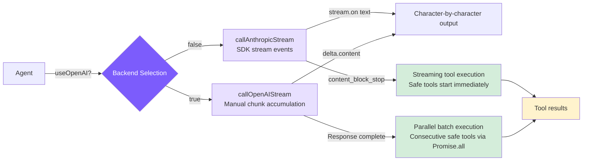

# 5. Streaming Output and Dual Backend

## Chapter Goals

Implement streaming output so responses appear character by character, and support both Anthropic and OpenAI API backends.



## How Claude Code Does It

### Why Streaming Output?

Models generate at roughly 30-80 tokens per second, so longer responses take 10-30 seconds. Users can tolerate staring at a blank screen for about 2-3 seconds at most. Streaming output makes the first character appear within a few hundred milliseconds, turning "wait 30 seconds" into "watch content gradually being written" -- the perceived wait drops to near zero, and users can interrupt early if things go off track.

Under the hood, it uses SSE (Server-Sent Events): the server pushes `data:` lines over a single persistent HTTP connection, sending a `content_block_delta` event every few tokens. Simpler than WebSocket, and one-way push is sufficient for LLM applications.

### Streaming Processing and Parallel Tool Execution

A key optimization in Claude Code: the `StreamingToolExecutor` starts executing fully-parsed tool_use blocks while the model is still generating subsequent content. In a serial approach, tool execution can only begin after the full API response arrives; with streaming parallelism, the first tool_use block is dispatched the moment it's fully parsed, without waiting for the second.

Within a typical 5-30 second API stream window, file reads (< 100ms) can almost entirely fit in -- by the time the stream ends, tool results are often already ready.

### Error Retry

Not all errors are worth retrying: 429/503/529 and transient network failures (ECONNRESET) are retryable; 400/401/404 reflect code or configuration issues, so retrying is pointless.

The rationale for exponential backoff (rather than fixed intervals): when a service is overloaded, many clients retrying simultaneously after a fixed 1-second delay creates a "retry storm" that makes the overload worse. Exponential backoff doubles the interval each round (1s -> 2s -> 4s), and adding random jitter breaks client synchronization -- this is standard distributed fault tolerance practice.

## Our Implementation

### Anthropic Backend: SDK Built-in Stream

<!-- tabs:start -->
#### **TypeScript**
```typescript
// agent.ts -- callAnthropicStream

private async callAnthropicStream(): Promise<Anthropic.Message> {
  return withRetry(async (signal) => {
    const createParams: any = {
      model: this.model,
      max_tokens: this.thinkingMode !== "disabled" ? maxOutput : 16384,
      system: this.systemPrompt,
      tools: toolDefinitions,
      messages: this.anthropicMessages,
    };

    if (this.thinkingMode === "enabled") {
      createParams.thinking = { type: "enabled", budget_tokens: maxOutput - 1 };
    } else if (this.thinkingMode === "adaptive") {
      createParams.thinking = { type: "enabled", budget_tokens: 10000 };
    }

    const stream = this.anthropicClient!.messages.stream(createParams, { signal });

    let firstText = true;
    stream.on("text", (text) => {
      if (firstText) { printAssistantText("\n"); firstText = false; }
      printAssistantText(text);
    });

    const finalMessage = await stream.finalMessage();

    // Don't store thinking blocks in history to avoid wasting context window
    if (this.thinkingMode !== "disabled") {
      finalMessage.content = finalMessage.content.filter(
        (block: any) => block.type !== "thinking"
      );
    }

    return finalMessage;
  }, this.abortController?.signal);
}
```
#### **Python**
```python
# agent.py -- _call_anthropic_stream

async def _call_anthropic_stream(self):
    async def _do():
        create_params: dict[str, Any] = {
            "model": self.model,
            "max_tokens": _get_max_output_tokens(self.model) if self._thinking_mode != "disabled" else 16384,
            "system": self._system_prompt,
            "tools": self.tools,
            "messages": self._anthropic_messages,
        }

        if self._thinking_mode in ("adaptive", "enabled"):
            create_params["thinking"] = {"type": "enabled", "budget_tokens": _get_max_output_tokens(self.model) - 1}

        first_text = True
        async with self._anthropic_client.messages.stream(**create_params) as stream:
            async for event in stream:
                if hasattr(event, 'type') and event.type == "content_block_delta":
                    delta = event.delta
                    if hasattr(delta, 'text'):
                        if first_text:
                            stop_spinner()
                            self._emit_text("\n")
                            first_text = False
                        self._emit_text(delta.text)

            final_message = await stream.get_final_message()

        final_message.content = [b for b in final_message.content if b.type != "thinking"]
        return final_message

    return await _with_retry(_do)
```
<!-- tabs:end -->

The Anthropic SDK encapsulates all SSE parsing details: `stream.on("text")` directly delivers text deltas, and `stream.finalMessage()` returns a `Message` object identical to the non-streaming version. `{ signal }` passes in an AbortController, allowing Ctrl+C to abort the network request.

### OpenAI Compatible Backend: Manual Chunk Accumulation

OpenAI streaming delivers tool_calls parameters across multiple chunks, requiring manual accumulation and reconstruction.

<!-- tabs:start -->
#### **TypeScript**
```typescript
// agent.ts -- callOpenAIStream

private async callOpenAIStream(): Promise<OpenAI.ChatCompletion> {
  return withRetry(async (signal) => {
    const stream = await this.openaiClient!.chat.completions.create({
      model: this.model,
      max_tokens: 16384,
      tools: toOpenAITools(),
      messages: this.openaiMessages,
      stream: true,
      stream_options: { include_usage: true },
    }, { signal });

    let content = "";
    let firstText = true;
    const toolCalls: Map<number, { id: string; name: string; arguments: string }> = new Map();
    let finishReason = "";
    let usage: { prompt_tokens: number; completion_tokens: number } | undefined;

    for await (const chunk of stream) {
      const delta = chunk.choices[0]?.delta;

      if (chunk.usage) {
        usage = { prompt_tokens: chunk.usage.prompt_tokens, completion_tokens: chunk.usage.completion_tokens };
      }

      if (!delta) continue;

      if (delta.content) {
        if (firstText) { printAssistantText("\n"); firstText = false; }
        printAssistantText(delta.content);
        content += delta.content;
      }

      // tool_calls parameters arrive in fragments, accumulated by index
      if (delta.tool_calls) {
        for (const tc of delta.tool_calls) {
          const existing = toolCalls.get(tc.index);
          if (existing) {
            if (tc.function?.arguments) existing.arguments += tc.function.arguments;
          } else {
            toolCalls.set(tc.index, {
              id: tc.id || "",
              name: tc.function?.name || "",
              arguments: tc.function?.arguments || "",
            });
          }
        }
      }

      if (chunk.choices[0]?.finish_reason) finishReason = chunk.choices[0].finish_reason;
    }

    const assembledToolCalls = toolCalls.size > 0
      ? Array.from(toolCalls.entries())
          .sort(([a], [b]) => a - b)
          .map(([_, tc]) => ({
            id: tc.id, type: "function" as const,
            function: { name: tc.name, arguments: tc.arguments },
          }))
      : undefined;

    return {
      id: "stream", object: "chat.completion", created: Date.now(), model: this.model,
      choices: [{
        index: 0,
        message: { role: "assistant" as const, content: content || null, tool_calls: assembledToolCalls, refusal: null },
        finish_reason: finishReason || "stop", logprobs: null,
      }],
      usage: usage || { prompt_tokens: 0, completion_tokens: 0, total_tokens: 0 },
    } as OpenAI.ChatCompletion;
  }, this.abortController?.signal);
}
```
#### **Python**
```python
# agent.py -- _call_openai_stream

async def _call_openai_stream(self) -> dict:
    async def _do():
        stream = await self._openai_client.chat.completions.create(
            model=self.model,
            max_tokens=16384,
            tools=_to_openai_tools(self.tools),
            messages=self._openai_messages,
            stream=True,
            stream_options={"include_usage": True},
        )

        content = ""
        first_text = True
        tool_calls: dict[int, dict] = {}
        finish_reason = ""
        usage = None

        async for chunk in stream:
            if chunk.usage:
                usage = {"prompt_tokens": chunk.usage.prompt_tokens, "completion_tokens": chunk.usage.completion_tokens}

            if not chunk.choices:
                continue
            delta = chunk.choices[0].delta

            if delta and delta.content:
                if first_text:
                    stop_spinner()
                    self._emit_text("\n")
                    first_text = False
                self._emit_text(delta.content)
                content += delta.content

            if delta and delta.tool_calls:
                for tc in delta.tool_calls:
                    existing = tool_calls.get(tc.index)
                    if existing:
                        if tc.function and tc.function.arguments:
                            existing["arguments"] += tc.function.arguments
                    else:
                        tool_calls[tc.index] = {
                            "id": tc.id or "",
                            "name": (tc.function.name if tc.function else "") or "",
                            "arguments": (tc.function.arguments if tc.function else "") or "",
                        }

            if chunk.choices[0].finish_reason:
                finish_reason = chunk.choices[0].finish_reason

        assembled = [
            {"id": tc["id"], "type": "function", "function": {"name": tc["name"], "arguments": tc["arguments"]}}
            for _, tc in sorted(tool_calls.items())
        ] if tool_calls else None

        return {
            "choices": [{"message": {"role": "assistant", "content": content or None, "tool_calls": assembled},
                         "finish_reason": finish_reason or "stop"}],
            "usage": usage or {"prompt_tokens": 0, "completion_tokens": 0},
        }

    return await _with_retry(_do)
```
<!-- tabs:end -->

For OpenAI tool_calls, the `id` and `name` only appear in the first chunk, and subsequent chunks only contain incremental `arguments` fragments. Chunks for multiple tool_calls arrive interleaved, distinguished by the `index` field -- you can only `JSON.parse()` after accumulation is complete.

### Tool Format Conversion

The two APIs have nearly identical tool definitions, just with different field names:

<!-- tabs:start -->
#### **TypeScript**
```typescript
function toOpenAITools(): OpenAI.ChatCompletionTool[] {
  return toolDefinitions.map((t) => ({
    type: "function" as const,
    function: { name: t.name, description: t.description, parameters: t.input_schema as Record<string, unknown> },
  }));
}
```
#### **Python**
```python
def _to_openai_tools(tools: list[ToolDef]) -> list[dict]:
    return [{"type": "function", "function": {"name": t["name"], "description": t["description"], "parameters": t["input_schema"]}} for t in tools]
```
<!-- tabs:end -->

Anthropic uses `input_schema`, OpenAI uses `parameters` -- the content is identical.

### Retry Mechanism

<!-- tabs:start -->
#### **TypeScript**
```typescript
function isRetryable(error: any): boolean {
  const status = error?.status || error?.statusCode;
  if ([429, 503, 529].includes(status)) return true;
  if (error?.code === "ECONNRESET" || error?.code === "ETIMEDOUT") return true;
  if (error?.message?.includes("overloaded")) return true;
  return false;
}

async function withRetry<T>(
  fn: (signal?: AbortSignal) => Promise<T>,
  signal?: AbortSignal,
  maxRetries = 3
): Promise<T> {
  for (let attempt = 0; ; attempt++) {
    try {
      return await fn(signal);
    } catch (error: any) {
      if (signal?.aborted) throw error;
      if (attempt >= maxRetries || !isRetryable(error)) throw error;
      const delay = Math.min(1000 * Math.pow(2, attempt), 30000) + Math.random() * 1000;
      const reason = error?.status ? `HTTP ${error.status}` : error?.code || "network error";
      printRetry(attempt + 1, maxRetries, reason);
      await new Promise((r) => setTimeout(r, delay));
    }
  }
}
```
#### **Python**
```python
def _is_retryable(error: Exception) -> bool:
    status = getattr(error, "status_code", None) or getattr(error, "status", None)
    if status in (429, 503, 529):
        return True
    msg = str(error)
    if "overloaded" in msg or "ECONNRESET" in msg or "ETIMEDOUT" in msg:
        return True
    return False

async def _with_retry(fn, max_retries: int = 3):
    for attempt in range(max_retries + 1):
        try:
            return await fn()
        except Exception as error:
            if attempt >= max_retries or not _is_retryable(error):
                raise
            delay = min(1000 * (2 ** attempt), 30000) / 1000 + (hash(str(time.time())) % 1000) / 1000
            reason = str(getattr(error, "status_code", "")) or str(error)[:60]
            print_retry(attempt + 1, max_retries, reason)
            await asyncio.sleep(delay)
```
<!-- tabs:end -->

The delay formula `min(1000 * 2^attempt, 30000) + random(0, 1000)`: the exponential part controls backoff speed, the 30-second cap prevents excessively long waits, and random jitter prevents multiple clients from retrying in sync and creating a "retry storm."

### Extended Thinking

Extended Thinking gives the model a private "scratchpad" for reasoning and planning before output, which noticeably helps with coding tasks requiring multi-step decisions.

Three modes:
- **adaptive**: Automatically enabled for claude-4.x models, budget of 10000 tokens, model decides whether to use it
- **enabled**: Explicitly enabled via `--thinking` flag, budget maximized
- **disabled**: For models that don't support thinking (Claude 3.x and OpenAI)

<!-- tabs:start -->
#### **TypeScript**
```typescript
function resolveThinkingMode(model: string, thinkingFlag: boolean): "adaptive" | "enabled" | "disabled" {
  if (!modelSupportsThinking(model)) return "disabled";
  if (thinkingFlag) return "enabled";
  if (modelSupportsAdaptiveThinking(model)) return "adaptive";
  return "disabled";
}

// Constructing request parameters
if (this.thinkingMode === "enabled") {
  createParams.thinking = { type: "enabled", budget_tokens: maxOutput - 1 };
} else if (this.thinkingMode === "adaptive") {
  createParams.thinking = { type: "enabled", budget_tokens: 10000 };
}

// Filter out thinking blocks, don't store in history
finalMessage.content = finalMessage.content.filter((block: any) => block.type !== "thinking");
```
#### **Python**
```python
def _resolve_thinking_mode(self) -> str:
    if not self.thinking or not _model_supports_thinking(self.model):
        return "disabled"
    if _model_supports_adaptive_thinking(self.model):
        return "adaptive"
    return "enabled"

# Constructing request parameters
if self._thinking_mode in ("adaptive", "enabled"):
    create_params["thinking"] = {"type": "enabled", "budget_tokens": max_output - 1}

# Filter out thinking blocks, don't store in history
final_message.content = [b for b in final_message.content if b.type != "thinking"]
```
<!-- tabs:end -->

Thinking blocks can be thousands of tokens long and have no reference value for subsequent conversation. Filtering them out is the most direct way to prevent the context window from being filled with useless content.

### Streaming Tool Execution

When a `tool_use` block in the Anthropic streaming response is fully received (triggered by a `content_block_stop` event), if the tool is concurrency-safe (`read_file`, `list_files`, `grep_search`, `web_fetch`), execution starts immediately -- without waiting for the entire API response to complete. This "hides" tool execution time within the streaming window while the model generates subsequent content.

<!-- tabs:start -->
#### **TypeScript**
```typescript
// agent.ts -- Streaming tool execution

// Track early-executed tools during streaming
const earlyExecutions = new Map<string, Promise<string>>();

const response = await this.callAnthropicStream((block) => {
  const input = block.input as Record<string, any>;
  if (CONCURRENCY_SAFE_TOOLS.has(block.name)) {
    const perm = checkPermission(block.name, input, this.permissionMode, this.planFilePath || undefined);
    if (perm.action === "allow") {
      earlyExecutions.set(block.id, this.executeToolCall(block.name, input));
    }
  }
});

// When processing tool results later:
const earlyPromise = earlyExecutions.get(toolUse.id);
if (earlyPromise) {
  const raw = await earlyPromise;  // Already complete or about to complete
  // ... use result directly
  continue;
}
```
#### **Python**
```python
# agent.py -- Streaming tool execution

# Track early-executed tools during streaming
early_executions: dict[str, asyncio.Task] = {}

async def on_tool_block_complete(block):
    if block["name"] in CONCURRENCY_SAFE_TOOLS:
        perm = check_permission(block["name"], block["input"], self._permission_mode)
        if perm["action"] == "allow":
            task = asyncio.create_task(self._execute_tool_call(block["name"], block["input"]))
            early_executions[block["id"]] = task

response = await self._call_anthropic_stream(on_tool_block_complete=on_tool_block_complete)

# When processing tool results later:
early_task = early_executions.get(tool_use["id"])
if early_task:
    raw = await early_task  # Already complete or about to complete
    # ... use result directly
    continue
```
<!-- tabs:end -->

`callAnthropicStream` implements this internally through a callback mechanism:

<!-- tabs:start -->
#### **TypeScript**
```typescript
// agent.ts -- callAnthropicStream tool block tracking

private async callAnthropicStream(
  onToolBlockComplete?: (block: Anthropic.ToolUseBlock) => void,
): Promise<Anthropic.Message> {
  // ...
  const toolBlocksByIndex = new Map<number, { id: string; name: string; inputJson: string }>();

  stream.on("streamEvent" as any, (event: any) => {
    // Tool block tracking: accumulate input JSON as stream arrives
    if (event.type === "content_block_start" && event.content_block?.type === "tool_use") {
      toolBlocksByIndex.set(event.index, {
        id: event.content_block.id,
        name: event.content_block.name,
        inputJson: "",
      });
    }
    if (event.type === "content_block_delta" && event.delta?.type === "input_json_delta") {
      const tracked = toolBlocksByIndex.get(event.index);
      if (tracked) tracked.inputJson += event.delta.partial_json;
    }
    if (event.type === "content_block_stop" && onToolBlockComplete) {
      const tracked = toolBlocksByIndex.get(event.index);
      if (tracked) {
        try {
          const input = JSON.parse(tracked.inputJson);
          onToolBlockComplete({ type: "tool_use", id: tracked.id, name: tracked.name, input });
        } catch {}
      }
    }
  });
  // ...
}
```
#### **Python**
```python
# agent.py -- _call_anthropic_stream tool block tracking

async def _call_anthropic_stream(self, on_tool_block_complete=None):
    async def _do():
        # ...
        tool_blocks_by_index: dict[int, dict] = {}

        async with self._anthropic_client.messages.stream(**create_params) as stream:
            async for event in stream:
                # Tool block tracking: accumulate input JSON as stream arrives
                if hasattr(event, 'type'):
                    if event.type == "content_block_start" and getattr(event, 'content_block', None):
                        cb = event.content_block
                        if cb.type == "tool_use":
                            tool_blocks_by_index[event.index] = {
                                "id": cb.id, "name": cb.name, "input_json": ""
                            }
                    elif event.type == "content_block_delta" and hasattr(event.delta, 'partial_json'):
                        tracked = tool_blocks_by_index.get(event.index)
                        if tracked:
                            tracked["input_json"] += event.delta.partial_json
                    elif event.type == "content_block_stop" and on_tool_block_complete:
                        tracked = tool_blocks_by_index.get(event.index)
                        if tracked:
                            try:
                                inp = json.loads(tracked["input_json"])
                                await on_tool_block_complete({
                                    "type": "tool_use", "id": tracked["id"],
                                    "name": tracked["name"], "input": inp
                                })
                            except json.JSONDecodeError:
                                pass

            final_message = await stream.get_final_message()
        # ...
```
<!-- tabs:end -->

Key design points:

- **`content_block_stop` is a block-level event**: It fires when a single `tool_use` block's JSON is fully received, not when the entire response ends. The model may return multiple tool calls in one response -- the first block may complete while the second is still streaming
- **Only concurrency-safe tools execute early**: Only read-only tools (`read_file`, `list_files`, `grep_search`, `web_fetch`) are executed early; write operations and command execution are not
- **Permission checks still apply**: Only tools where `checkPermission` returns `"allow"` execute early; tools requiring user confirmation (`"confirm"`) are not triggered early
- **Promises/Tasks are stored, awaited later**: The `earlyExecutions` Map stores Promises (TS) or Tasks (Python). When the subsequent tool processing loop finds an early execution result, it simply awaits it -- typically already complete by then
- **Core benefit**: During the 5-30 second streaming window, tool execution runs in parallel with model generation. Fast operations like file reads are often already complete by the time the stream ends

### Parallel Tool Execution

The prerequisite for parallel execution is marking which tools are concurrency-safe -- read-only tools have no side effects and can safely run simultaneously:

<!-- tabs:start -->
#### **TypeScript**
```typescript
// tools.ts
export const CONCURRENCY_SAFE_TOOLS = new Set([
  "read_file", "list_files", "grep_search", "web_fetch"
]);
```
#### **Python**
```python
# tools.py
CONCURRENCY_SAFE_TOOLS = {"read_file", "list_files", "grep_search", "web_fetch"}
```
<!-- tabs:end -->

For the Anthropic backend, streaming tool execution naturally handles parallelism -- each tool block starts executing upon completion, and multiple tools naturally overlap in execution.

For the OpenAI backend (which doesn't support streaming tool block events), explicit batch parallelism is used: consecutive safe tools are grouped and executed all at once with `Promise.all` / `asyncio.gather`:

<!-- tabs:start -->
#### **TypeScript**
```typescript
// agent.ts -- OpenAI parallel execution

// Group consecutive concurrency-safe tools into batches
type OAIBatch = { concurrent: boolean; items: OAIChecked[] };
const oaiBatches: OAIBatch[] = [];
for (const ct of oaiChecked) {
  const safe = ct.allowed && CONCURRENCY_SAFE_TOOLS.has(ct.fnName);
  if (safe && oaiBatches.length > 0 && oaiBatches[oaiBatches.length - 1].concurrent) {
    oaiBatches[oaiBatches.length - 1].items.push(ct);
  } else {
    oaiBatches.push({ concurrent: safe, items: [ct] });
  }
}

// Execution: concurrent batches use Promise.all
for (const batch of oaiBatches) {
  if (batch.concurrent) {
    const results = await Promise.all(
      batch.items.map(async (ct) => {
        const raw = await this.executeToolCall(ct.fnName, ct.input);
        return { ct, res: this.persistLargeResult(ct.fnName, raw) };
      })
    );
    // ... push results
  } else {
    // Non-safe tools execute sequentially
  }
}
```
#### **Python**
```python
# agent.py -- OpenAI parallel execution

# Group consecutive concurrency-safe tools into batches
oai_batches: list[dict] = []
for ct in oai_checked:
    safe = ct["allowed"] and ct["fn_name"] in CONCURRENCY_SAFE_TOOLS
    if safe and oai_batches and oai_batches[-1]["concurrent"]:
        oai_batches[-1]["items"].append(ct)
    else:
        oai_batches.append({"concurrent": safe, "items": [ct]})

# Execution: concurrent batches use asyncio.gather
for batch in oai_batches:
    if batch["concurrent"]:
        async def _exec(ct):
            raw = await self._execute_tool_call(ct["fn_name"], ct["input"])
            return {"ct": ct, "res": self._persist_large_result(ct["fn_name"], raw)}
        results = await asyncio.gather(*[_exec(ct) for ct in batch["items"]])
        # ... push results
    else:
        # Non-safe tools execute sequentially
```
<!-- tabs:end -->

Comparison of parallel strategies between the two backends:

- **Anthropic backend**: Streaming execution handles parallelism automatically -- tools start upon block completion, and multiple tool executions naturally overlap
- **OpenAI backend**: Explicit batching after response completion -- consecutive safe tools are grouped into the same batch and executed in parallel with `Promise.all`
- **Mixed sequences maintain safety**: `[read, read, write, read]` gets split into `[read||read]`, `[write]`, `[read]` -- three batches. Tools before and after write operations are independent and don't parallelize across write operations
- **Typical speedup**: When the model reads 3-5 files in a single response, parallel execution usually brings a 2-3x speed improvement

## Comparison

| Dimension | Claude Code | mini-claude |
|-----------|------------|-------------|
| **Backend support** | Anthropic only | Anthropic + OpenAI compatible |
| **Retry strategy** | Similar exponential backoff | Exponential backoff + random jitter |
| **Thinking handling** | Deep integration, independent display and folding | Basic support, filter thinking blocks |
| **Streaming tool execution** | StreamingToolExecutor as standalone module, full event handling | Callback + earlyExecutions Map, streamlined implementation |
| **Parallel tool execution** | Full concurrency scheduler | Anthropic streaming early execution + OpenAI batch Promise.all |

---

> **Next chapter**: The Agent can now manipulate files and execute commands, but we need to prevent it from doing dangerous things -- the permission system protects your system.
