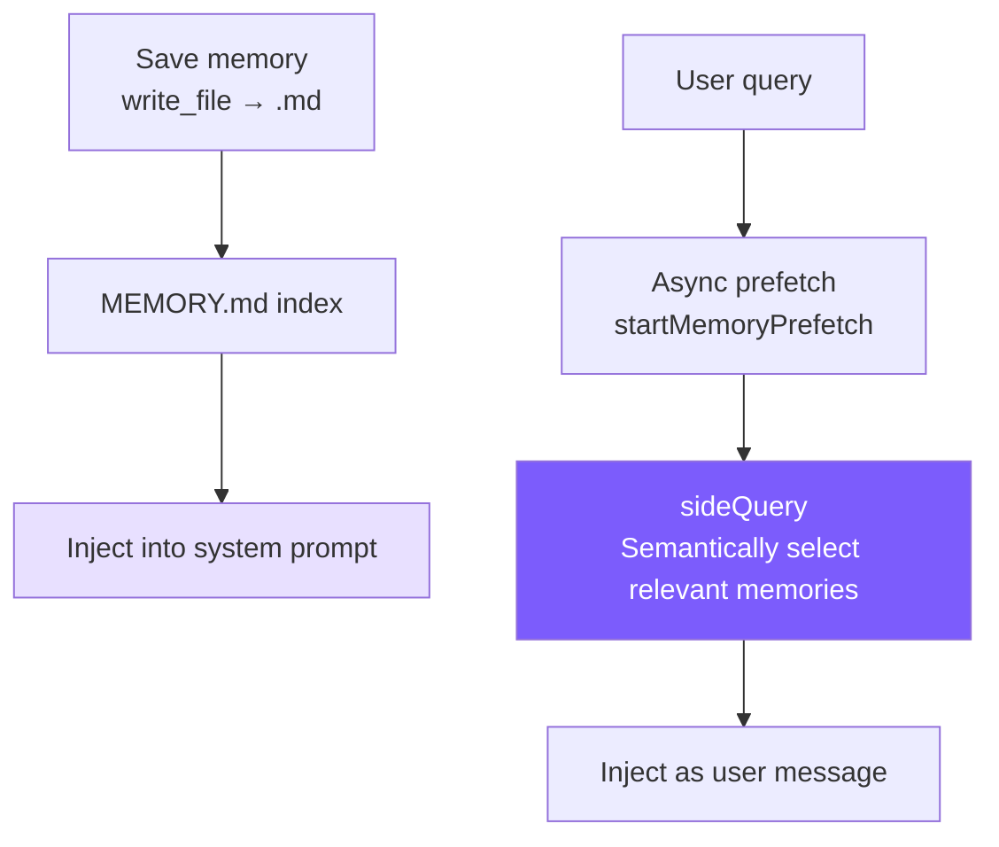

# 8. Memory System

## Chapter Goals

Implement cross-session memory: let the Agent maintain awareness of the user and project across multiple conversations, without relying on conversation history.



---

## How Claude Code Does It

The core constraint of Claude Code's memory system boils down to one rule: **only remember information that cannot be derived from the current project state**. Code patterns, architecture, file paths, git history, ongoing debugging -- these can all be obtained by reading code and `git log`, and storing them in memory only creates drift. Even information the user explicitly asks to save is no exception -- if a user says "remember this PR list," the Agent should push back: what in this list is non-derivable? A specific deadline? An unexpected finding?

Memories are divided into four types:

| Type | What to Remember | When to Trigger |
|------|-----------------|----------------|
| **user** | User identity, preferences, knowledge background | When learning about user role/preferences |
| **feedback** | Corrections **and affirmations** of Agent behavior | When user corrects or affirms a behavior |
| **project** | Project progress, decisions, deadlines | When learning about project dynamics |
| **reference** | Locator information for external systems | When learning about external system locations |

A closed taxonomy rather than free-form tags -- to prevent tag proliferation that leads to fuzzy matching during recall.

The `feedback` type has a nuance: it records not just corrections but also user affirmations. The reasoning is practical: only recording "mistakes" helps the model avoid repeating them, but may also inadvertently cause it to abandon practices the user has already validated as good. Both types also require the body to include `Why` and `How to apply` -- because knowing "why" is essential for judging edge cases; blindly following rules often backfires.

The `project` type has a specific requirement: relative dates must be converted to absolute dates. "Merge freeze after Thursday" -> "Merge freeze after 2026-03-05." Memories may be read weeks later, when "Thursday" has become meaningless.

**MEMORY.md is an index, not a container.** It's loaded in full into the system prompt every session, so it must be compact -- one line per entry with a link, actual content read on demand. It has dual truncation at 200 lines / 25KB, with an appended hint when exceeded: "keep index entries to one line under ~200 chars." Error messages include fix guidance -- a design habit that runs throughout the entire system.

**The recall mechanism** uses `sideQuery` to call the model for semantic matching, rather than keyword search. When a user asks about "deployment process," semantic matching can find a memory titled "CI/CD Considerations," while keyword matching cannot. Recall executes asynchronously while the model starts generating its response (`pendingMemoryPrefetch`), so the delay is nearly zero from the user's perspective. Each recall returns at most 5 entries, keeping context cost controlled.

Each memory also carries a **freshness warning** -- memories older than 1 day are annotated with how many days have passed, reminding the model that memories are point-in-time snapshots, not live state. A memory saying "deadline next week" would be misleading two weeks later if the model doesn't know it might be outdated.

---

## Our Implementation

### Storage Structure

```
~/.mini-claude/projects/{sha256-hash}/memory/
├── MEMORY.md                          # Index file
├── user_prefers_concise_output.md
├── feedback_no_summary_at_end.md
├── project_auth_migration_q2.md
└── reference_ci_dashboard_url.md
```

The hash in the path is the first 16 characters of the sha256 of `process.cwd()` -- the same project directory always maps to the same memory space.

### Memory File Format

```markdown
---
name: Don't summarize at the end of responses
description: User explicitly asked to skip summary paragraphs
type: feedback
---
User said "don't summarize at the end of responses" because they can review diffs and code changes themselves.

**Why:** User finds summaries a waste of time and prefers getting results directly.
**How to apply:** After completing a task, end immediately without adding "Summary" or "In summary..." paragraphs.
```

### Frontmatter Parsing (Shared Module)

Both memory and skills need to parse YAML frontmatter, so it's extracted into `frontmatter.ts`:

<!-- tabs:start -->
#### **TypeScript**
```typescript
// frontmatter.ts

export function parseFrontmatter(content: string): FrontmatterResult {
  const lines = content.split("\n");
  if (lines[0]?.trim() !== "---") return { meta: {}, body: content };

  let endIdx = -1;
  for (let i = 1; i < lines.length; i++) {
    if (lines[i].trim() === "---") { endIdx = i; break; }
  }
  if (endIdx === -1) return { meta: {}, body: content };

  const meta: Record<string, string> = {};
  for (let i = 1; i < endIdx; i++) {
    const colonIdx = lines[i].indexOf(":");
    if (colonIdx === -1) continue;
    const key = lines[i].slice(0, colonIdx).trim();
    const value = lines[i].slice(colonIdx + 1).trim();
    if (key) meta[key] = value;
  }

  const body = lines.slice(endIdx + 1).join("\n").trim();
  return { meta, body };
}
```
#### **Python**
```python
# frontmatter.py

@dataclass
class FrontmatterResult:
    meta: dict[str, str] = field(default_factory=dict)
    body: str = ""


def parse_frontmatter(content: str) -> FrontmatterResult:
    lines = content.split("\n")
    if not lines or lines[0].strip() != "---":
        return FrontmatterResult(body=content)

    end_idx = -1
    for i in range(1, len(lines)):
        if lines[i].strip() == "---":
            end_idx = i
            break
    if end_idx == -1:
        return FrontmatterResult(body=content)

    meta: dict[str, str] = {}
    for i in range(1, end_idx):
        colon_idx = lines[i].find(":")
        if colon_idx == -1:
            continue
        key = lines[i][:colon_idx].strip()
        value = lines[i][colon_idx + 1:].strip()
        if key:
            meta[key] = value

    body = "\n".join(lines[end_idx + 1:]).strip()
    return FrontmatterResult(meta=meta, body=body)
```
<!-- tabs:end -->

No library like `js-yaml` is used -- our frontmatter is just simple `key: value` pairs, and a 20-line hand-written parser is sufficient with zero dependencies.

### Saving and Indexing

<!-- tabs:start -->
#### **TypeScript**
```typescript
// memory.ts -- saveMemory

export function saveMemory(entry: Omit<MemoryEntry, "filename">): string {
  const dir = getMemoryDir();
  const filename = `${entry.type}_${slugify(entry.name)}.md`;
  const content = formatFrontmatter(
    { name: entry.name, description: entry.description, type: entry.type },
    entry.content
  );
  writeFileSync(join(dir, filename), content);
  updateMemoryIndex();
  return filename;
}

function updateMemoryIndex(): void {
  const memories = listMemories();
  const lines = ["# Memory Index", ""];
  for (const m of memories) {
    lines.push(`- **[${m.name}](${m.filename})** (${m.type}) — ${m.description}`);
  }
  writeFileSync(getIndexPath(), lines.join("\n"));
}
```
#### **Python**
```python
# memory.py -- save_memory

def save_memory(name: str, description: str, type: str, content: str) -> str:
    d = get_memory_dir()
    filename = f"{type}_{_slugify(name)}.md"
    text = format_frontmatter(
        {"name": name, "description": description, "type": type}, content
    )
    (d / filename).write_text(text)
    _update_memory_index()
    return filename

def _update_memory_index() -> None:
    memories = list_memories()
    lines = ["# Memory Index", ""]
    for m in memories:
        lines.append(f"- **[{m.name}]({m.filename})** ({m.type}) — {m.description}")
    _get_index_path().write_text("\n".join(lines))
```
<!-- tabs:end -->

The filename format `{type}_{slugified_name}.md` makes files automatically group by type when sorted in the filesystem, and is easy to scan visually. The index is rebuilt immediately after each write to keep MEMORY.md in sync with the filesystem.

### Index Truncation

<!-- tabs:start -->
#### **TypeScript**
```typescript
// memory.ts -- loadMemoryIndex

const MAX_INDEX_LINES = 200;
const MAX_INDEX_BYTES = 25000;

export function loadMemoryIndex(): string {
  // ...
  const lines = content.split("\n");
  if (lines.length > MAX_INDEX_LINES) {
    content = lines.slice(0, MAX_INDEX_LINES).join("\n") +
      "\n\n[... truncated, too many memory entries ...]";
  }
  if (Buffer.byteLength(content) > MAX_INDEX_BYTES) {
    content = content.slice(0, MAX_INDEX_BYTES) +
      "\n\n[... truncated, index too large ...]";
  }
  return content;
}
```
#### **Python**
```python
# memory.py -- load_memory_index

MAX_INDEX_LINES = 200
MAX_INDEX_BYTES = 25000

def load_memory_index() -> str:
    index_path = _get_index_path()
    if not index_path.exists():
        return ""
    content = index_path.read_text()
    lines = content.split("\n")
    if len(lines) > MAX_INDEX_LINES:
        content = "\n".join(lines[:MAX_INDEX_LINES]) + "\n\n[... truncated, too many memory entries ...]"
    if len(content.encode()) > MAX_INDEX_BYTES:
        content = content[:MAX_INDEX_BYTES] + "\n\n[... truncated, index too large ...]"
    return content
```
<!-- tabs:end -->

The two truncation layers serve different purposes: line truncation (200 lines) is normal protection, cutting at complete entry boundaries; byte truncation (25KB) is abnormal defense, catching cases where line count is low but individual lines are extremely long -- the Claude Code team has seen cases in production with 197KB crammed into 200 lines.

### System Prompt Injection

`buildMemoryPromptSection()` generates text injected into the system prompt, telling the model about the memory system's existence and usage:

<!-- tabs:start -->
#### **TypeScript**
```typescript
// memory.ts -- buildMemoryPromptSection (simplified)

export function buildMemoryPromptSection(): string {
  const index = loadMemoryIndex();
  const memoryDir = getMemoryDir();

  return `# Memory System

You have a persistent, file-based memory system at \`${memoryDir}\`.

## Memory Types
- **user**: User's role, preferences, knowledge level
- **feedback**: Corrections and guidance from the user
- **project**: Ongoing work, goals, deadlines, decisions
- **reference**: Pointers to external resources

## How to Save Memories
Use the write_file tool to create a memory file with YAML frontmatter:
...
Save to: \`${memoryDir}/\`
Filename format: \`{type}_{slugified_name}.md\`

## What NOT to Save
- Code patterns or architecture (read the code instead)
- Git history (use git log)
- Anything already in CLAUDE.md
- Ephemeral task details

${index ? `## Current Memory Index\n${index}` : "(No memories saved yet.)"}`;
}
```
#### **Python**
```python
# memory.py -- build_memory_prompt_section (simplified)

def build_memory_prompt_section() -> str:
    index = load_memory_index()
    memory_dir = str(get_memory_dir())

    return f"""# Memory System

You have a persistent, file-based memory system at `{memory_dir}`.

## Memory Types
- **user**: User's role, preferences, knowledge level
- **feedback**: Corrections and guidance from the user
- **project**: Ongoing work, goals, deadlines, decisions
- **reference**: Pointers to external resources

## How to Save Memories
Use the write_file tool to create a memory file with YAML frontmatter:
...
Save to: `{memory_dir}/`
Filename format: `{{type}}_{{slugified_name}}.md`

## What NOT to Save
- Code patterns or architecture (read the code instead)
- Git history (use git log)
- Anything already in CLAUDE.md
- Ephemeral task details

{"## Current Memory Index" + chr(10) + index if index else "(No memories saved yet.)"}"""
```
<!-- tabs:end -->

This prompt does three things: teaches the model classification (four types), teaches it operations (use `write_file`, where to save, what format), and teaches it restraint ("What NOT to Save"). "Making the model use memory" isn't just about giving it a tool -- you also need to describe the complete type system and boundaries in the prompt so the model can make good decisions.

Finally, it's injected in `prompt.ts` via a placeholder:

<!-- tabs:start -->
#### **TypeScript**
```typescript
systemPrompt = systemPrompt.replace("{{memory}}", buildMemoryPromptSection());
```
#### **Python**
```python
result = result.replace("{{memory}}", build_memory_prompt_section())
```
<!-- tabs:end -->

### CLI Interaction

Users can type `/memory` in the REPL to list all memories:

<!-- tabs:start -->
#### **TypeScript**
```typescript
if (input === "/memory") {
  const memories = listMemories();
  if (memories.length === 0) {
    printInfo("No memories saved yet.");
  } else {
    printInfo(`${memories.length} memories:`);
    for (const m of memories) {
      console.log(`    [${m.type}] ${m.name} — ${m.description}`);
    }
  }
}
```
#### **Python**
```python
if inp == "/memory":
    memories = list_memories()
    if not memories:
        print_info("No memories saved yet.")
    else:
        print_info(f"{len(memories)} memories:")
        for m in memories:
            print(f"    [{m.type}] {m.name} — {m.description}")
    continue
```
<!-- tabs:end -->

---

### Semantic Recall (sideQuery)

The early version used keyword matching for memory recall -- splitting the query into words and counting hits per memory entry for ranking. This was simple but limited: when a user asks about "deployment process," a memory titled "CI/CD Considerations" gets zero matches because there are no common keywords.

The new version uses `sideQuery` for semantic recall: it sends all memory filenames and descriptions to the model and lets the model determine which ones are relevant to the current query.

```typescript
// memory.ts -- selectRelevantMemories

const SELECT_MEMORIES_PROMPT = `You are selecting memories that will be useful to an AI coding assistant as it processes a user's query. You will be given the user's query and a list of available memory files with their filenames and descriptions.

Return a JSON object with a "selected_memories" array of filenames for the memories that will clearly be useful (up to 5). Only include memories that you are certain will be helpful based on their name and description.
- If you are unsure if a memory will be useful, do not include it.
- If no memories would clearly be useful, return an empty array.`;

export async function selectRelevantMemories(
  query: string,
  sideQuery: SideQueryFn,
  alreadySurfaced: Set<string>,
  signal?: AbortSignal,
): Promise<RelevantMemory[]> {
  const headers = scanMemoryHeaders();
  if (headers.length === 0) return [];

  // Filter out memories already surfaced in this session
  const candidates = headers.filter((h) => !alreadySurfaced.has(h.filePath));
  if (candidates.length === 0) return [];

  const manifest = formatMemoryManifest(candidates);

  try {
    const text = await sideQuery(
      SELECT_MEMORIES_PROMPT,
      `Query: ${query}\n\nAvailable memories:\n${manifest}`,
      signal,
    );

    // Extract JSON from response (model may wrap in markdown code blocks)
    const jsonMatch = text.match(/\{[\s\S]*\}/);
    if (!jsonMatch) return [];

    const parsed = JSON.parse(jsonMatch[0]);
    const selectedFilenames: string[] = parsed.selected_memories || [];

    // Map filenames back to headers, read full content
    const filenameSet = new Set(selectedFilenames);
    const selected = candidates.filter((h) => filenameSet.has(h.filename));

    return selected.slice(0, 5).map((h) => {
      let content = readFileSync(h.filePath, "utf-8");
      // Per-file truncation (4KB)
      if (Buffer.byteLength(content) > MAX_MEMORY_BYTES_PER_FILE) {
        content = content.slice(0, MAX_MEMORY_BYTES_PER_FILE) +
          "\n\n[... truncated, memory file too large ...]";
      }
      const freshness = memoryFreshnessWarning(h.mtimeMs);
      const headerText = freshness
        ? `${freshness}\n\nMemory: ${h.filePath}:`
        : `Memory (saved ${memoryAge(h.mtimeMs)}): ${h.filePath}:`;

      return { path: h.filePath, content, mtimeMs: h.mtimeMs, header: headerText };
    });
  } catch (err: any) {
    // Silent failure -- memory recall should never block the main loop
    if (signal?.aborted) return [];
    console.error(`[memory] semantic recall failed: ${err.message}`);
    return [];
  }
}
```

Several key design points:

**sideQuery uses the same model, not a separate smaller model.** Claude Code uses Sonnet for sideQuery; we simplify by reusing the user's configured model. sideQuery only sends the memory manifest (filenames + descriptions), not full content, so input tokens are minimal.

**The model does semantic selection, which is far more powerful than keyword matching.** "Deployment process" can match "CI/CD Considerations," "database performance" can match "PostgreSQL Index Optimization Experience" -- because the model understands semantic relationships, not just literal overlap.

**The `alreadySurfaced` Set prevents duplicate recalls.** Memories already shown in the current session won't appear again, avoiding the user seeing the same memories with every question. This Set grows throughout the session lifetime.

**Per-file 4KB truncation + 60KB session budget.** Prevents a single large memory or accumulated recalls from crowding out context. The budget uses byte-level control, not token-level -- byte calculation is faster and more fair for multilingual text.

> **Comparison with old keyword matching (now replaced):** The old implementation split queries into words and matched them one by one -- zero API calls but low accuracy. The new version consumes 1 API call per recall, but the semantic understanding capability is a qualitative leap. For tutorial projects with few memories, this API cost is entirely acceptable.

### Async Prefetch (startMemoryPrefetch)

Semantic recall requires an API call, and executing it synchronously would add to user wait time. The solution: **start recall the instant the user submits input, running in parallel with the first model API call.**

```typescript
// memory.ts -- startMemoryPrefetch

export function startMemoryPrefetch(
  query: string,
  sideQuery: SideQueryFn,
  alreadySurfaced: Set<string>,
  sessionMemoryBytes: number,
  signal?: AbortSignal,
): MemoryPrefetch | null {
  // Gate 1: Skip single-word queries (too short for semantic matching)
  if (!/\s/.test(query.trim())) return null;

  // Gate 2: Session budget is full
  if (sessionMemoryBytes >= MAX_SESSION_MEMORY_BYTES) return null;

  // Gate 3: No memory files exist
  const dir = getMemoryDir();
  const hasMemories = readdirSync(dir).some(
    (f) => f.endsWith(".md") && f !== "MEMORY.md"
  );
  if (!hasMemories) return null;

  const handle: MemoryPrefetch = {
    promise: selectRelevantMemories(query, sideQuery, alreadySurfaced, signal),
    settled: false,
    consumed: false,
  };
  handle.promise.then(() => { handle.settled = true; }).catch(() => { handle.settled = true; });
  return handle;
}
```

Usage in `agent.ts`:

```typescript
// agent.ts -- Prefetch launch and consumption

// Start prefetch immediately after user message arrives
this.anthropicMessages.push({ role: "user", content: userMessage });
let memoryPrefetch: MemoryPrefetch | null = null;
if (!this.isSubAgent) {
  const sq = this.buildSideQuery();
  if (sq) {
    memoryPrefetch = startMemoryPrefetch(
      userMessage, sq,
      this.alreadySurfacedMemories, this.sessionMemoryBytes,
      this.abortController?.signal,
    );
  }
}

// Non-blocking poll in the while loop, before each API call
if (memoryPrefetch && memoryPrefetch.settled && !memoryPrefetch.consumed) {
  memoryPrefetch.consumed = true;
  const memories = await memoryPrefetch.promise;
  if (memories.length > 0) {
    const injectionText = formatMemoriesForInjection(memories);
    this.anthropicMessages.push({ role: "user", content: injectionText });
    // Track surfaced memories and session budget
    for (const m of memories) {
      this.alreadySurfacedMemories.add(m.path);
      this.sessionMemoryBytes += Buffer.byteLength(m.content);
    }
  }
}
```

The key to this design is **non-blocking polling**:

1. **Prefetch starts at user input time** -- runs in parallel with the first model API call, so the user perceives no extra delay
2. **Checked every loop iteration** -- if prefetch hasn't completed, it's skipped without waiting; checked again next iteration
3. **`settled` flag is set via `.then()`** -- no `await`, results are only read after confirmed completion
4. **Marked `consumed = true` after use** -- ensures the same prefetch is only injected once

Three gating conditions avoid wasting API calls:
- **Multi-word query**: A single word (like "hi") is too short for meaningful semantic matching
- **Session budget**: Stops recall after exceeding 60KB cumulative, preventing context overload
- **Memory existence**: Skips when no memory files exist, saving an API call

`formatMemoriesForInjection` wraps each memory in `<system-reminder>` tags and injects them as user messages:

```typescript
export function formatMemoriesForInjection(memories: RelevantMemory[]): string {
  return memories
    .map((m) => `<system-reminder>\n${m.header}\n\n${m.content}\n</system-reminder>`)
    .join("\n\n");
}
```

### Freshness Warning

Memories are point-in-time snapshots, not live state. A memory saying "project deadline next week" is outdated when read two weeks later, and the model would give incorrect advice if it doesn't know this.

```typescript
// memory.ts -- memoryFreshnessWarning

export function memoryFreshnessWarning(mtimeMs: number): string {
  const days = Math.max(0, Math.floor((Date.now() - mtimeMs) / 86_400_000));
  if (days <= 1) return "";
  return `This memory is ${days} days old. Memories are point-in-time observations, not live state — claims about code behavior may be outdated. Verify against current code before asserting as fact.`;
}
```

The rule is simple: no prompt within 1 day (information is essentially fresh), but a warning is attached after 1 day. The warning text explicitly tells the model two things: "this is an observation from a past point in time" and "verify against current code before stating as fact." This is more effective than simply labeling "X days ago" -- it provides an action directive, not just information.

---

## Key Design Decisions

**Why use the filesystem instead of a database for memory?** Three benefits: users can directly read and write memory files with an editor; the model can operate using existing `write_file`/`read_file` tools without needing a dedicated memory API; and it can be put under git version control if desired. The memory system "piggybacks" on the tool system, reducing the number of interfaces that need to be exposed.

**Why semantic recall instead of keyword matching?** Keyword matching can only find memories with literal overlap. Semantic recall understands the connection between "deployment process" and "CI/CD Considerations." The cost is 1 API call per recall, but sideQuery only sends the memory manifest (filenames + descriptions), so input tokens are minimal and cost is low. For scenarios with limited memories, this trade-off is well worth it.

**Why async prefetch instead of synchronous recall?** Synchronous recall means the user has to wait an extra API round-trip with every question. Prefetch runs in parallel with the first model call -- if prefetch finishes first, memories are visible in the first response; if not, they catch up in the second round. In the worst case, memories arrive one round late, but the user never has to wait.

**Why a session-level budget?** Unlimited recall would fill the context with memories, crowding out actual conversation content. The 60KB budget is roughly equivalent to 20-30 medium-length memories, sufficient to cover a session's context needs. The `alreadySurfaced` set combined with the budget cap makes memory recall increasingly precise as the session progresses -- already-shown items don't repeat, and only truly needed items fit within the budget.

### Comparison Overview

| Dimension | Claude Code | mini-claude |
|-----------|------------|-------------|
| **Recall method** | Sonnet sideQuery semantic matching | sideQuery semantic matching (same model) |
| **Async prefetch** | pendingMemoryPrefetch | startMemoryPrefetch |
| **Session budget** | 60KB | 60KB |
| **Freshness** | Staleness warning | Staleness warning |
| **API calls** | 1 per recall | 1 per recall |

---

> **Next chapter**: Reusable prompt modules -- the skills system.
