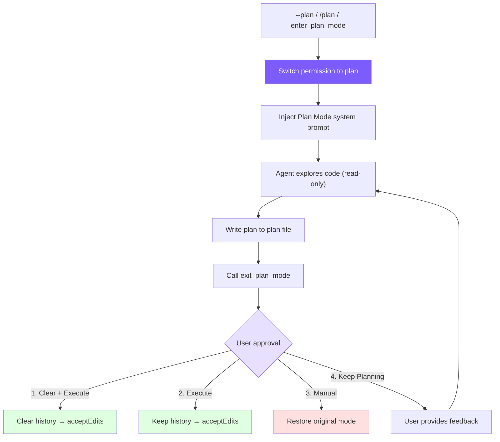

# 10. Plan Mode: Read-Only Planning Mode

## Chapter Goals

Implement Plan Mode: have the Agent formulate a plan before executing, avoiding blind code modifications. This includes mode switching, plan file persistence, permission integration, and a 4-option approval workflow.



## How Claude Code Does It

Claude Code's Plan Mode is a complete EnterPlanMode / ExitPlanMode tool pair:

1. **Enter**: Switch to read-only mode, generate a plan file (in the `~/.claude/plans/` directory), inject a plan system prompt to constrain Agent behavior
2. **Plan**: The Agent uses read-only tools to explore the code and writes the implementation plan to the plan file
3. **Exit**: The Agent calls ExitPlanMode, and the user sees the plan and chooses how to execute
4. **Approve**: The user chooses to clear context and execute, keep context and execute, manually approve each edit, or continue revising

Key design insight: **Plan Mode isn't about "preventing the Agent from doing things" -- it's about making the Agent think before acting**. Persisting the plan file to disk means that even if context is cleared, the plan won't be lost -- the Agent can start fresh executing an approved plan.

## Our Implementation

### Tool Definitions

Plan Mode requires two tools, marked as `deferred` (lazy-loaded, see [Chapter 2](/en/docs/02-tools.md)):

<!-- tabs:start -->
#### **TypeScript**
```typescript
// tools.ts — Plan Mode tool definitions

// ─── Plan mode tools ────────────────────────────────────────
{
  name: "enter_plan_mode",
  description:
    "Enter plan mode to switch to a read-only planning phase. In plan mode, you can only read files and write to the plan file. Use this when you need to explore the codebase and design an implementation plan before making changes.",
  input_schema: {
    type: "object" as const,
    properties: {},
  },
  deferred: true,
},
{
  name: "exit_plan_mode",
  description:
    "Exit plan mode after you have finished writing your plan to the plan file. The user will review and approve the plan before you proceed with implementation.",
  input_schema: {
    type: "object" as const,
    properties: {},
  },
  deferred: true,
},
```
#### **Python**
```python
# tools.py — Plan Mode tool definitions

{
    "name": "enter_plan_mode",
    "description": "Enter plan mode to switch to a read-only planning phase. ...",
    "input_schema": {"type": "object", "properties": {}},
    "deferred": True,
},
{
    "name": "exit_plan_mode",
    "description": "Exit plan mode after you have finished writing your plan to the plan file. ...",
    "input_schema": {"type": "object", "properties": {}},
    "deferred": True,
},
```
<!-- tabs:end -->

Neither tool takes parameters -- entering and exiting are pure state transitions, and all data (plan file path, approval result) is managed internally by the Agent. They're marked `deferred` because most sessions don't need Plan Mode, and lazy loading avoids consuming prompt space.

### Mode Switching

Plan Mode involves 4 state variables:

<!-- tabs:start -->
#### **TypeScript**
```typescript
// agent.ts — Plan Mode state

// Plan mode state
private prePlanMode: PermissionMode | null = null;    // Mode before entering (for restoration)
private planFilePath: string | null = null;            // Plan file path
private baseSystemPrompt: string = "";                 // Base prompt without plan injection
private contextCleared: boolean = false;               // Whether context was cleared during approval
```
#### **Python**
```python
# agent.py — Plan Mode state

self._pre_plan_mode: str | None = None      # Mode before entering
self._plan_file_path: str | None = None     # Plan file path
self._base_system_prompt: str = ""           # Base prompt
self._context_cleared: bool = False          # Whether context was cleared
```
<!-- tabs:end -->

`prePlanMode` is critical -- it remembers the permission mode before entering Plan Mode so it can be precisely restored on exit. If the user was in `acceptEdits` mode, exiting Plan Mode should return to `acceptEdits`, not `default`.

The switching logic is a symmetric enter/exit:

<!-- tabs:start -->
#### **TypeScript**
```typescript
// agent.ts — togglePlanMode()

togglePlanMode(): string {
  if (this.permissionMode === "plan") {
    // Exit: restore original mode, clean up state, remove plan prompt
    this.permissionMode = this.prePlanMode || "default";
    this.prePlanMode = null;
    this.planFilePath = null;
    this.systemPrompt = this.baseSystemPrompt;
    if (this.useOpenAI && this.openaiMessages.length > 0) {
      (this.openaiMessages[0] as any).content = this.systemPrompt;
    }
    printInfo(`Exited plan mode → ${this.permissionMode} mode`);
    return this.permissionMode;
  } else {
    // Enter: save current mode, switch permission, generate plan file, inject prompt
    this.prePlanMode = this.permissionMode;
    this.permissionMode = "plan";
    this.planFilePath = this.generatePlanFilePath();
    this.systemPrompt = this.baseSystemPrompt + this.buildPlanModePrompt();
    if (this.useOpenAI && this.openaiMessages.length > 0) {
      (this.openaiMessages[0] as any).content = this.systemPrompt;
    }
    printInfo(`Entered plan mode. Plan file: ${this.planFilePath}`);
    return "plan";
  }
}
```
#### **Python**
```python
# agent.py — toggle_plan_mode()

def toggle_plan_mode(self) -> str:
    if self.permission_mode == "plan":
        self.permission_mode = self._pre_plan_mode or "default"
        self._pre_plan_mode = None
        self._plan_file_path = None
        self._system_prompt = self._base_system_prompt
        if self.use_openai and self._openai_messages:
            self._openai_messages[0]["content"] = self._system_prompt
        print_info(f"Exited plan mode → {self.permission_mode} mode")
        return self.permission_mode
    else:
        self._pre_plan_mode = self.permission_mode
        self.permission_mode = "plan"
        self._plan_file_path = self._generate_plan_file_path()
        self._system_prompt = self._base_system_prompt + self._build_plan_mode_prompt()
        if self.use_openai and self._openai_messages:
            self._openai_messages[0]["content"] = self._system_prompt
        print_info(f"Entered plan mode. Plan file: {self._plan_file_path}")
        return "plan"
```
<!-- tabs:end -->

Note how the system prompt is updated: on entry, the plan prompt is appended after `baseSystemPrompt`; on exit, it's restored to `baseSystemPrompt`. For the OpenAI format, the first message in the message array (the system message) needs to be directly modified.

### Plan File and System Prompt

The plan file path is generated based on the session ID, ensuring each session has its own independent plan file:

<!-- tabs:start -->
#### **TypeScript**
```typescript
// agent.ts — Plan file generation

private generatePlanFilePath(): string {
  const dir = join(homedir(), ".claude", "plans");
  if (!existsSync(dir)) mkdirSync(dir, { recursive: true });
  return join(dir, `plan-${this.sessionId}.md`);
}
```
#### **Python**
```python
# agent.py — Plan file generation

def _generate_plan_file_path(self) -> str:
    d = Path.home() / ".claude" / "plans"
    d.mkdir(parents=True, exist_ok=True)
    return str(d / f"plan-{self.session_id}.md")
```
<!-- tabs:end -->

The plan system prompt injects strict read-only constraints and workflow guidance:

<!-- tabs:start -->
#### **TypeScript**
```typescript
// agent.ts — buildPlanModePrompt()

private buildPlanModePrompt(): string {
  return `

# Plan Mode Active

Plan mode is active. You MUST NOT make any edits (except the plan file below),
run non-readonly tools, or make any changes to the system.

## Plan File: ${this.planFilePath}
Write your plan incrementally to this file using write_file or edit_file.
This is the ONLY file you are allowed to edit.

## Workflow
1. **Explore**: Read code to understand the task. Use read_file, list_files, grep_search.
2. **Design**: Design your implementation approach.
3. **Write Plan**: Write a structured plan to the plan file including:
   - **Context**: Why this change is needed
   - **Steps**: Implementation steps with critical file paths
   - **Verification**: How to test the changes
4. **Exit**: Call exit_plan_mode when your plan is ready for user review.

IMPORTANT: When your plan is complete, you MUST call exit_plan_mode.
Do NOT ask the user to approve — exit_plan_mode handles that.`;
}
```
#### **Python**
```python
# agent.py — _build_plan_mode_prompt()

def _build_plan_mode_prompt(self) -> str:
    return f"""

# Plan Mode Active

Plan mode is active. You MUST NOT make any edits (except the plan file below),
run non-readonly tools, or make any changes to the system.

## Plan File: {self._plan_file_path}
Write your plan incrementally to this file using write_file or edit_file.
This is the ONLY file you are allowed to edit.

## Workflow
1. **Explore**: Read code to understand the task. Use read_file, list_files, grep_search.
2. **Design**: Design your implementation approach.
3. **Write Plan**: Write a structured plan to the plan file including:
   - **Context**: Why this change is needed
   - **Steps**: Implementation steps with critical file paths
   - **Verification**: How to test the changes
4. **Exit**: Call exit_plan_mode when your plan is ready for user review.

IMPORTANT: When your plan is complete, you MUST call exit_plan_mode.
Do NOT ask the user to approve — exit_plan_mode handles that."""
```
<!-- tabs:end -->

This prompt accomplishes three things:
1. **Constrains behavior**: Explicitly prohibits editing and shell access (dual safeguard with permission checks)
2. **Declares the plan file**: Tells the model the only writable file path
3. **Defines the workflow**: Explore -> Design -> Write -> Exit, ensuring the model doesn't skip steps

The last sentence "Do NOT ask the user to approve" is crucial -- without it, the model frequently asks "Is this plan okay?" after writing the plan instead of calling `exit_plan_mode`, preventing the approval workflow from triggering.

### Permission Integration

Plan Mode's read-only constraint is enforced through `checkPermission()` (see [Chapter 6](/en/docs/06-permissions.md) for details):

<!-- tabs:start -->
#### **TypeScript**
```typescript
// tools.ts — Plan Mode handling in checkPermission()

// plan mode: block all write/edit tools (except plan file) and shell
if (mode === "plan") {
  if (EDIT_TOOLS.has(toolName)) {
    const filePath = input.file_path || input.path;
    if (planFilePath && filePath === planFilePath) {
      return { action: "allow" };  // Only exception: the plan file itself
    }
    return { action: "deny", message: `Blocked in plan mode: ${toolName}` };
  }
  if (toolName === "run_shell") {
    return { action: "deny", message: "Shell commands blocked in plan mode" };
  }
}

// plan mode tools: always allow (handled in agent.ts)
if (toolName === "enter_plan_mode" || toolName === "exit_plan_mode") {
  return { action: "allow" };
}
```
#### **Python**
```python
# tools.py — Plan Mode handling in check_permission()

if mode == "plan":
    if tool_name in EDIT_TOOLS:
        file_path = inp.get("file_path") or inp.get("path")
        if plan_file_path and file_path == plan_file_path:
            return {"action": "allow"}
        return {"action": "deny", "message": f"Blocked in plan mode: {tool_name}"}
    if tool_name == "run_shell":
        return {"action": "deny", "message": "Shell commands blocked in plan mode"}

if tool_name in ("enter_plan_mode", "exit_plan_mode"):
    return {"action": "allow"}
```
<!-- tabs:end -->

There's an elegant design here: **the plan file path is passed as a parameter to `checkPermission()`**. When the Agent tries to write a file, the permission check compares the target path against the plan file path -- only an exact match is allowed through. This means the system prompt's instruction to "only write the plan file" isn't just a suggestion -- it's a code-enforced constraint.

Dual safeguard:
- **System prompt**: Guides the model not to attempt writing other files (reduces wasted API calls)
- **Permission check**: Even if the model ignores the prompt, write operations are intercepted and return an error

### Tool Execution Logic

`executePlanModeTool()` handles the execution of `enter_plan_mode` and `exit_plan_mode`:

<!-- tabs:start -->
#### **TypeScript**
```typescript
// agent.ts — executePlanModeTool()

private async executePlanModeTool(name: string): Promise<string> {
  if (name === "enter_plan_mode") {
    if (this.permissionMode === "plan") {
      return "Already in plan mode.";
    }
    this.prePlanMode = this.permissionMode;
    this.permissionMode = "plan";
    this.planFilePath = this.generatePlanFilePath();
    this.systemPrompt = this.baseSystemPrompt + this.buildPlanModePrompt();
    if (this.useOpenAI && this.openaiMessages.length > 0) {
      (this.openaiMessages[0] as any).content = this.systemPrompt;
    }
    printInfo("Entered plan mode (read-only). Plan file: " + this.planFilePath);
    return `Entered plan mode. You are now in read-only mode.\n\n` +
      `Your plan file: ${this.planFilePath}\n` +
      `Write your plan to this file. This is the only file you can edit.\n\n` +
      `When your plan is complete, call exit_plan_mode.`;
  }

  if (name === "exit_plan_mode") {
    if (this.permissionMode !== "plan") {
      return "Not in plan mode.";
    }
    // Read plan file contents
    let planContent = "(No plan file found)";
    if (this.planFilePath && existsSync(this.planFilePath)) {
      planContent = readFileSync(this.planFilePath, "utf-8");
    }

    // Interactive approval workflow
    if (this.planApprovalFn) {
      const result = await this.planApprovalFn(planContent);

      if (result.choice === "keep-planning") {
        // User rejected — stay in plan mode, return feedback to model
        const feedback = result.feedback || "Please revise the plan.";
        return `User rejected the plan and wants to keep planning.\n\n` +
          `User feedback: ${feedback}\n\n` +
          `Please revise your plan based on this feedback. When done, call exit_plan_mode again.`;
      }

      // User approved — determine target permission mode
      let targetMode: PermissionMode;
      if (result.choice === "clear-and-execute" || result.choice === "execute") {
        targetMode = "acceptEdits";
      } else {
        targetMode = this.prePlanMode || "default";  // manual-execute: restore original mode
      }

      // Exit plan mode
      this.permissionMode = targetMode;
      this.prePlanMode = null;
      const savedPlanPath = this.planFilePath;
      this.planFilePath = null;
      this.systemPrompt = this.baseSystemPrompt;

      // Clear context (if clear-and-execute was chosen)
      if (result.choice === "clear-and-execute") {
        this.clearHistoryKeepSystem();
        this.contextCleared = true;
        printInfo(`Plan approved. Context cleared, executing in ${targetMode} mode.`);
        return `User approved the plan. Context was cleared. Permission mode: ${targetMode}\n\n` +
          `Plan file: ${savedPlanPath}\n\n## Approved Plan:\n${planContent}\n\nProceed with implementation.`;
      }

      printInfo(`Plan approved. Executing in ${targetMode} mode.`);
      return `User approved the plan. Permission mode: ${targetMode}\n\n` +
        `## Approved Plan:\n${planContent}\n\nProceed with implementation.`;
    }

    // Fallback: exit directly when no approval function exists (e.g., sub-agent)
    this.permissionMode = this.prePlanMode || "default";
    this.prePlanMode = null;
    this.planFilePath = null;
    this.systemPrompt = this.baseSystemPrompt;
    printInfo("Exited plan mode. Restored to " + this.permissionMode + " mode.");
    return `Exited plan mode. Permission mode restored to: ${this.permissionMode}\n\n` +
      `## Your Plan:\n${planContent}`;
  }

  return `Unknown plan mode tool: ${name}`;
}
```
#### **Python**
```python
# agent.py — _execute_plan_mode_tool()

async def _execute_plan_mode_tool(self, name: str) -> str:
    if name == "enter_plan_mode":
        if self.permission_mode == "plan":
            return "Already in plan mode."
        self._pre_plan_mode = self.permission_mode
        self.permission_mode = "plan"
        self._plan_file_path = self._generate_plan_file_path()
        self._system_prompt = self._base_system_prompt + self._build_plan_mode_prompt()
        if self.use_openai and self._openai_messages:
            self._openai_messages[0]["content"] = self._system_prompt
        print_info("Entered plan mode (read-only). Plan file: " + self._plan_file_path)
        return (
            f"Entered plan mode. You are now in read-only mode.\n\n"
            f"Your plan file: {self._plan_file_path}\n"
            f"Write your plan to this file. This is the only file you can edit.\n\n"
            f"When your plan is complete, call exit_plan_mode."
        )

    if name == "exit_plan_mode":
        if self.permission_mode != "plan":
            return "Not in plan mode."
        plan_content = "(No plan file found)"
        if self._plan_file_path and Path(self._plan_file_path).exists():
            plan_content = Path(self._plan_file_path).read_text()

        if self._plan_approval_fn:
            result = await self._plan_approval_fn(plan_content)
            choice = result.get("choice", "manual-execute")

            if choice == "keep-planning":
                feedback = result.get("feedback") or "Please revise the plan."
                return (
                    f"User rejected the plan and wants to keep planning.\n\n"
                    f"User feedback: {feedback}\n\n"
                    f"Please revise your plan based on this feedback. "
                    f"When done, call exit_plan_mode again."
                )

            if choice in ("clear-and-execute", "execute"):
                target_mode = "acceptEdits"
            else:
                target_mode = self._pre_plan_mode or "default"

            self.permission_mode = target_mode
            self._pre_plan_mode = None
            saved_plan_path = self._plan_file_path
            self._plan_file_path = None
            self._system_prompt = self._base_system_prompt

            if choice == "clear-and-execute":
                self._clear_history_keep_system()
                self._context_cleared = True
                print_info(f"Plan approved. Context cleared, executing in {target_mode} mode.")
                return (
                    f"User approved the plan. Context was cleared. "
                    f"Permission mode: {target_mode}\n\n"
                    f"Plan file: {saved_plan_path}\n\n"
                    f"## Approved Plan:\n{plan_content}\n\n"
                    f"Proceed with implementation."
                )

            print_info(f"Plan approved. Executing in {target_mode} mode.")
            return (
                f"User approved the plan. Permission mode: {target_mode}\n\n"
                f"## Approved Plan:\n{plan_content}\n\n"
                f"Proceed with implementation."
            )

        # Fallback: no approval function
        self.permission_mode = self._pre_plan_mode or "default"
        self._pre_plan_mode = None
        self._plan_file_path = None
        self._system_prompt = self._base_system_prompt
        print_info("Exited plan mode. Restored to " + self.permission_mode + " mode.")
        return (
            f"Exited plan mode. Permission mode restored to: {self.permission_mode}\n\n"
            f"## Your Plan:\n{plan_content}"
        )

    return f"Unknown plan mode tool: {name}"
```
<!-- tabs:end -->

The core logic has three layers:

1. **enter_plan_mode**: State switch + plan file creation + prompt injection. Idempotent design -- returns a hint rather than an error when already in plan mode.

2. **exit_plan_mode (with approval function)**: Read plan file -> call approval callback -> handle based on user's choice:
   - `keep-planning`: Don't exit plan mode; return user feedback as the tool result to the model
   - `clear-and-execute`: Clear message history (free up context) -> switch to `acceptEdits`
   - `execute`: Keep history -> switch to `acceptEdits`
   - `manual-execute`: Restore the mode from before entering (user manually approves each edit)

3. **exit_plan_mode (without approval function)**: Exit directly and restore the original mode. This branch is for the sub-agent scenario -- sub-agents don't need interactive user approval.

### Approval Workflow

Approval is injected via a callback function, decoupling the Agent from the UI layer:

<!-- tabs:start -->
#### **TypeScript**
```typescript
// cli.ts — Setting up the approval callback

agent.setPlanApprovalFn((planContent: string) => {
  return new Promise((resolve) => {
    printPlanForApproval(planContent);   // Display plan content
    printPlanApprovalOptions();          // Display 4 options

    const askChoice = () => {
      rl.question("  Enter choice (1-4): ", (answer) => {
        const choice = answer.trim();
        if (choice === "1") {
          resolve({ choice: "clear-and-execute" });
        } else if (choice === "2") {
          resolve({ choice: "execute" });
        } else if (choice === "3") {
          resolve({ choice: "manual-execute" });
        } else if (choice === "4") {
          rl.question("  Feedback (what to change): ", (feedback) => {
            resolve({ choice: "keep-planning", feedback: feedback.trim() || undefined });
          });
        } else {
          console.log("  Invalid choice. Enter 1, 2, 3, or 4.");
          askChoice();  // Retry on invalid input
        }
      });
    };
    askChoice();
  });
});
```
#### **Python**
```python
# __main__.py — Setting up the approval callback

async def plan_approval(plan_content: str) -> dict:
    print_plan_for_approval(plan_content)
    print_plan_approval_options()
    while True:
        choice = input("  Enter choice (1-4): ").strip()
        if choice == "1":
            return {"choice": "clear-and-execute"}
        elif choice == "2":
            return {"choice": "execute"}
        elif choice == "3":
            return {"choice": "manual-execute"}
        elif choice == "4":
            feedback = input("  Feedback (what to change): ").strip()
            return {"choice": "keep-planning", "feedback": feedback or None}
        else:
            print("  Invalid choice. Enter 1, 2, 3, or 4.")

agent.set_plan_approval_fn(plan_approval)
```
<!-- tabs:end -->

The UI portion displays the plan content and 4 options:

```typescript
// ui.ts — Plan approval UI

export function printPlanForApproval(planContent: string) {
  console.log(chalk.cyan("\n  ━━━ Plan for Approval ━━━"));
  const lines = planContent.split("\n");
  const maxLines = 60;
  const display = lines.slice(0, maxLines);
  for (const line of display) {
    console.log(chalk.white("  " + line));
  }
  if (lines.length > maxLines) {
    console.log(chalk.gray(`  ... (${lines.length - maxLines} more lines)`));
  }
  console.log(chalk.cyan("  ━━━━━━━━━━━━━━━━━━━━━━━━\n"));
}

export function printPlanApprovalOptions() {
  console.log(chalk.yellow("  Choose an option:"));
  console.log("    1) Yes, clear context and execute — fresh start with auto-accept edits");
  console.log("    2) Yes, and execute — keep context, auto-accept edits");
  console.log("    3) Yes, manually approve edits — keep context, confirm each edit");
  console.log("    4) No, keep planning — provide feedback to revise");
}
```

The four options are designed for different use cases:

| Option | Permission Switch | Context | Use Case |
|--------|------------------|---------|----------|
| 1. Clear + Execute | -> acceptEdits | Cleared | Plan is solid, context is long, starting fresh is most efficient |
| 2. Execute | -> acceptEdits | Kept | Plan is solid, Agent already has enough context to execute directly |
| 3. Manual | -> Restore original mode | Kept | Plan is roughly okay, but want to approve each modification step by step |
| 4. Keep Planning | Unchanged | Kept | Plan needs revision, provide feedback for the Agent to continue adjusting |

### CLI Entry Points

Plan Mode has three entry points:

<!-- tabs:start -->
#### **TypeScript**
```typescript
// cli.ts — CLI arguments

// 1. Command-line argument --plan
} else if (args[i] === "--plan") {
  permissionMode = "plan";

// 2. REPL command /plan
if (input === "/plan") {
  const newMode = agent.togglePlanMode();
  askQuestion();
  return;
}

// 3. Agent autonomously calls enter_plan_mode tool (lazy-loaded via ToolSearch)
```
#### **Python**
```python
# __main__.py — CLI arguments

# 1. Command-line argument --plan
elif arg == "--plan":
    permission_mode = "plan"

# 2. REPL command /plan
if user_input == "/plan":
    agent.toggle_plan_mode()
    continue

# 3. Agent autonomously calls enter_plan_mode tool
```
<!-- tabs:end -->

The difference between the three entry points:
- `--plan`: Enter Plan Mode at startup; the entire session starts with planning
- `/plan`: Switch mid-session, suitable for a "chat first, plan later" workflow
- `enter_plan_mode` tool: The Agent decides on its own that it needs to plan before executing (requires activation via ToolSearch)

## Design Decisions

### Why Write Plan Files to Disk?

Plan file persistence to `~/.claude/plans/` serves two purposes:

1. **Required for the clear-and-execute option**: After clearing context, the plan content in conversation history is lost. But the plan file remains on disk, so the Agent can re-read it.
2. **Available across sessions**: Users can see previous plans when restoring a session with `--resume`, or manually browse historical plan files.

### Why Is Approval a Callback Instead of a Direct Implementation?

`planApprovalFn` is an externally injected callback rather than a direct implementation inside the Agent. This keeps the Agent class independent of any specific UI implementation -- the CLI uses readline, an IDE integration could use a GUI dialog, and tests can inject mock functions. When a sub-agent has no approval function, it simply exits directly with no special handling needed.

### Why Does Clear-and-Execute Switch to acceptEdits?

Since the user has approved the plan and chosen automatic execution, they trust the Agent's direction of changes. Switching to `acceptEdits` lets the Agent proceed without repeatedly confirming each file edit, dramatically improving execution efficiency. If the user wants step-by-step approval, option 3 is specifically for that.

## Simplification Comparison

| Dimension | Claude Code | mini-claude | Difference |
|-----------|------------|-------------|------------|
| Plan file | Global plans directory + semantic filenames | `~/.claude/plans/plan-{sessionId}.md` | Simplified naming |
| Approval options | Multiple execution modes + permission prompts | 4 options (clear/execute/manual/revise) | Core alignment |
| Permission integration | Deep integration (7-layer permission system) | checkPermission special branch + plan file whitelist | Simplified but equivalent |
| Tool loading | Always available | deferred lazy loading | Saves prompt space |
| Sub-agent | Plan Agent type | Fallback direct exit | Simplified branch |

---

> **Next chapter**: When a single Agent's context isn't enough -- multi-agent architecture, divide and conquer.
