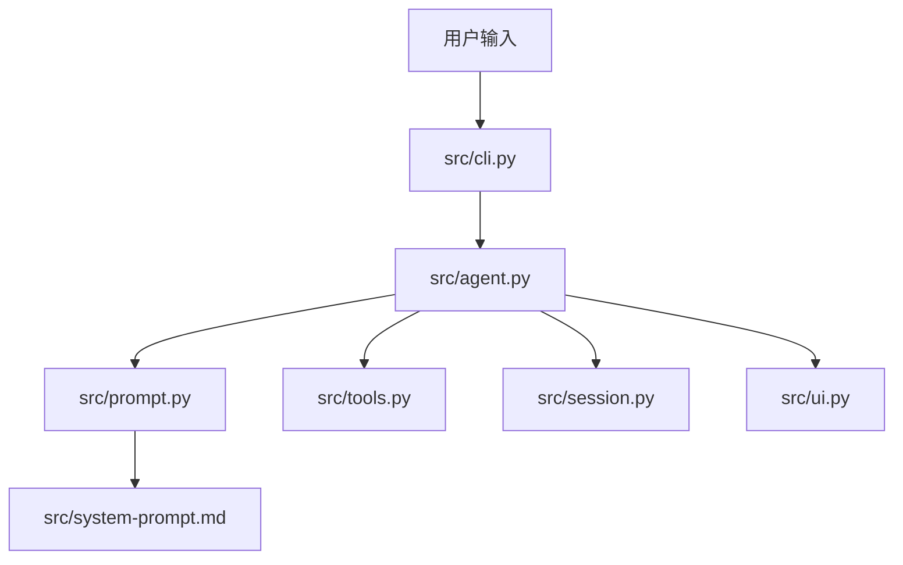

# Claude Code From Scratch - Python Edition

> 一步一步，从零造一个 Python 版 Mini Claude Code

[English](./README_EN.md)

> 本目录计划作为 `claude-code-from-scratch` 仓库根目录下的 `python_version/` 子目录提交 PR。

本项目基于 `claude-code-from-scratch` 的章节结构，用 Python 重写了同一套最小可用 coding agent：

- Agent Loop
- 工具系统（6 个核心工具）
- System Prompt
- Anthropic + OpenAI 兼容后端
- 权限确认
- 上下文压缩
- CLI / REPL / 会话持久化

## 架构图



## 项目结构

```text
claude-code-from-scratch/
└── python_version/
    ├── main.py
    ├── requirements.txt
    ├── README.md
    ├── README_EN.md
    ├── src/
    │   ├── __init__.py
    │   ├── agent.py
    │   ├── cli.py
    │   ├── prompt.py
    │   ├── session.py
    │   ├── system-prompt.md
    │   ├── tools.py
    │   └── ui.py
    └── docs/
        ├── 00-introduction.md
        ├── 01-agent-loop.md
        ├── 02-tools.md
        ├── 03-system-prompt.md
        ├── 04-streaming.md
        ├── 05-safety.md
        ├── 06-context.md
        ├── 07-cli-session.md
        └── 08-whats-next.md
```

## 快速开始

```bash
git clone https://github.com/Windy3f3f3f3f/claude-code-from-scratch.git
cd claude-code-from-scratch/python_version
pip install -r requirements.txt
python -m src --help
```

## 当前后端模式说明

当前实现不是写死某一个后端，而是运行时自动选择：

1. 显式传入 `--api-base` 时：走 OpenAI 兼容后端。
2. 未传 `--api-base`，但设置了 `OPENAI_API_KEY` + `OPENAI_BASE_URL`：走 OpenAI 兼容后端。
3. 未满足上面条件，但设置了 `ANTHROPIC_API_KEY`：走 Anthropic 后端。
4. 仅设置 `OPENAI_API_KEY`：也会走 OpenAI 兼容后端（`OPENAI_BASE_URL` 可为空，使用 SDK 默认地址）。

你当前如果主要使用 `OPENAI_API_KEY`/`OPENAI_BASE_URL`，那实际运行的就是 OpenAI 兼容模式。
如果你在 PR 环境里只配置 `ANTHROPIC_API_KEY`，且没有传入 OpenAI 相关参数，则会走 Anthropic 模式。

Anthropic 模式：

```bash
set ANTHROPIC_API_KEY=sk-ant-xxx
python -m src
```

OpenAI 兼容模式：

```bash
set OPENAI_API_KEY=sk-xxx
set OPENAI_BASE_URL=https://api.openai.com/v1
python -m src --model gpt-4o
```

## 对齐说明

- 行为优先对齐参考 TS 教程与源码，不主动“修正”参考中的细节差异。
- 例如模型上下文映射保留了参考中的条目命名（含可能不常见的版本串）。
- 章节说明见 docs 目录。
