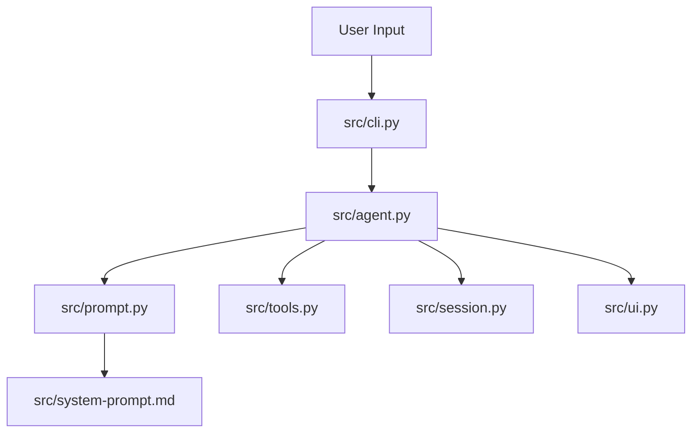

# Claude Code From Scratch - Python Edition

> Build a Python version of Mini Claude Code step by step.

[中文](./README.md)

> This directory is intended to be submitted as the `python_version/` subdirectory under the `claude-code-from-scratch` repository root.

This project rewrites the same tutorial structure from `claude-code-from-scratch` in Python, while preserving the same core architecture:

- Agent Loop
- Tool System (6 core tools)
- System Prompt Engineering
- Anthropic + OpenAI-compatible backends
- Safety confirmation
- Context compaction
- CLI / REPL / session persistence

## Architecture



## Project Layout

```text
claude-code-from-scratch/
└── python_version/
    ├── main.py
    ├── requirements.txt
    ├── README.md
    ├── README_EN.md
    ├── src/
    │   ├── __init__.py
    │   ├── agent.py
    │   ├── cli.py
    │   ├── prompt.py
    │   ├── session.py
    │   ├── system-prompt.md
    │   ├── tools.py
    │   └── ui.py
    └── docs/
        ├── 00-introduction.md
        ├── 01-agent-loop.md
        ├── 02-tools.md
        ├── 03-system-prompt.md
        ├── 04-streaming.md
        ├── 05-safety.md
        ├── 06-context.md
        ├── 07-cli-session.md
        └── 08-whats-next.md
```

## Quick Start

```bash
git clone https://github.com/Windy3f3f3f3f/claude-code-from-scratch.git
cd claude-code-from-scratch/python_version
pip install -r requirements.txt
python -m src --help
```

## Current Backend Selection

This implementation does not hardcode a single backend; it selects one at runtime:

1. If `--api-base` is provided: use OpenAI-compatible backend.
2. If `--api-base` is not provided, but `OPENAI_API_KEY` + `OPENAI_BASE_URL` are set: use OpenAI-compatible backend.
3. Otherwise, if `ANTHROPIC_API_KEY` is set: use Anthropic backend.
4. If only `OPENAI_API_KEY` is set: still use OpenAI-compatible backend (`OPENAI_BASE_URL` can be omitted to use SDK default).

If your environment is mainly `OPENAI_API_KEY`/`OPENAI_BASE_URL`, your current runtime backend is OpenAI-compatible.
If your PR/runtime environment only configures `ANTHROPIC_API_KEY` and no OpenAI-specific settings are passed, it will run in Anthropic mode.

Anthropic mode:

```bash
set ANTHROPIC_API_KEY=sk-ant-xxx
python -m src
```

OpenAI-compatible mode:

```bash
set OPENAI_API_KEY=sk-xxx
set OPENAI_BASE_URL=https://api.openai.com/v1
python -m src --model gpt-4o
```

## Commenting Rules Applied

- Every class and function uses a structured docstring template (Parameters/Returns/Raises/Examples).
- Key logic sections use `# 1)` and `# 2)` segment comments.
- Complex streaming/object-conversion parts include line-by-line explanatory comments.

## Alignment Notes

- Behavior is intentionally aligned with the reference TS tutorial and source.
- This implementation does not proactively "fix" reference-level quirks.
- For example, model context map entries are kept aligned with the reference naming.
