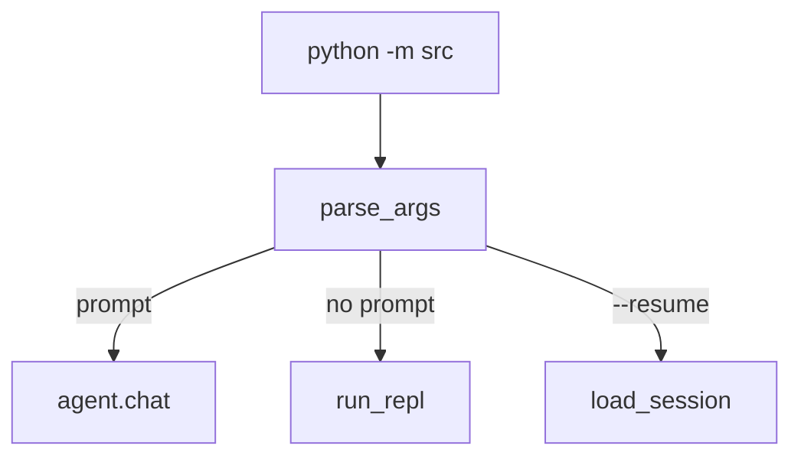

# 07. CLI 与会话

## 本章实现

对应文件：

- `src/cli.py`
- `src/session.py`
- `src/__main__.py` （标准包入口）

## 运行模式



## REPL 命令

- `/clear`
- `/cost`
- `/compact`

## Ctrl+C 语义

1. 处理中：中断当前任务。
2. 空闲中：第一次提示，第二次退出。

## 会话存储

- 路径：`~/.mini-claude/sessions/*.json`
- 内容：metadata + 消息历史

## 核心代码（REPL 与持久化）

```python
def run_repl(agent: Agent) -> None:
    """
    运行交互式 REPL。

    Parameters:
        agent (Agent): Agent 实例。

    Returns:
        None: 持续读取输入直到退出。
    """
    print_welcome()
    while True:
        print_user_prompt()
        user_input = input().strip()

        # 1) 内建命令优先处理。
        if user_input == "/clear":
            agent.clear_history()
            continue
        if user_input == "/cost":
            agent.show_cost()
            continue
        if user_input == "/compact":
            agent.compact()
            continue

        # 2) 普通输入进入主循环。
        if user_input in {"exit", "quit"}:
            return
        if user_input:
            agent.chat(user_input)
```

```python
def save_session(session_id: str, data: dict) -> None:
    """
    保存会话数据到 JSON。

    Parameters:
        session_id (str): 会话 ID。
        data (dict): 会话完整数据。

    Returns:
        None
    """
    ensure_dir()
    file_path = SESSION_DIR / f"{session_id}.json"
    file_path.write_text(json.dumps(data, ensure_ascii=False, indent=2), encoding="utf-8")
```

代码作用：

1. `run_repl` 体现 CLI 层只做命令路由，不承载模型逻辑。
2. `save_session` 让会话在每轮后可恢复，支持 `--resume`。
3. 命令层和存储层分离，方便后续替换 UI 或存储格式。
